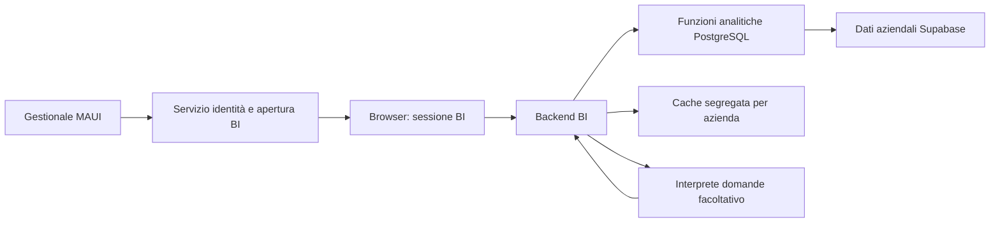

# Business Intelligence — Architettura tecnologica

**Versione:** 0.1 · **Data:** 8 settembre 2026  
**Stato:** guida di progetto; requisiti concordati e architettura proposta, non implementata.  
**Destinatari:** responsabile del progetto e sviluppatori.

## 1. Scopo e documenti collegati

Realizzare una dashboard web professionale, avviata dal gestionale MAUI e fruibile nel browser, per analizzare i dati della singola azienda. Le aree sono **Viaggi/Clienti** e **Contabilità/Finanza**. L'azienda iniziale è **2 — Sardegna Fuori Traccia**; l'architettura deve funzionare per altre aziende senza ramificazioni dedicate all'azienda 2.

Questa guida definisce i confini tecnici. Le altre due guide definiscono:

- [Esposizione, fruizione e risultato atteso](02_Esposizione_Fruizione_Risultato_Atteso.md): report, metriche, confronti e interazioni.
- [Modifiche e integrazioni DB](03_Modifiche_Integrazioni_DB.md): fonti, contratto analitico, sicurezza e migrazioni previste.

Le regole di [overview.md](../../Documents/overview.md) restano vincolanti, in particolare DB-first, riuso della logica e aggiornamento della documentazione. Le decisioni successive devono aggiornare queste guide: non devono restare soltanto nella conversazione.

## 2. Decisioni concordate

| Decisione | Vincolo |
|---|---|
| Fruizione | Browser esterno, aperto tramite un bottone MAUI |
| Identità | Utente autenticato e azienda verificati lato server |
| Silos | Nessuna consultazione di dati di altre aziende, inclusi dettagli e risposte AI |
| Aree | Tutti gli utenti aziendali accedono a entrambe; nessun nuovo flag per differenziarli |
| Sessione | Il logout MAUI **non** termina la sessione browser |
| Esperienza | Report guidati molto curati, con filtri, confronti e approfondimenti |
| Aggiornamento | Pulsante esplicito, con data/ora dell'ultima lettura |
| Logica dati | Tutto DB-first; definizioni condivise tra report e domande libere |
| Ambienti | Schema Docker come destinazione; dati Supabase come riferimento operativo |

Il go-live di allineamento era previsto per il **9 settembre 2026** al momento della stesura. Questo documento **non ne attesta l'esecuzione**: la versione effettiva di produzione dovrà essere verificata prima dello sviluppo delle query definitive.

## 3. Architettura proposta

La proposta è una web app dedicata: **React/TypeScript** per l'interfaccia, **Apache ECharts** per i grafici e **ASP.NET Core** per il backend. Le versioni supportate e le dipendenze saranno scelte e fissate all'avvio dell'implementazione; non si assume che il nuovo backend debba usare la stessa versione .NET del client MAUI.

Il diagramma rappresenta responsabilità logiche, non microservizi da distribuire separatamente. **Un unico backend modulare è sufficiente come punto di partenza.**

| Componente | Responsabilità |
|---|---|
| MAUI | Avviare l'accesso con una credenziale verificabile dal server |
| Servizio identità | Autenticare, ricavare azienda e utente, emettere/revocare sessioni e autorizzazioni di apertura |
| Frontend | Filtri, grafici, tabelle, drill-down, visualizzazione delle definizioni |
| Backend BI | Autorizzazione, validazione dei parametri, chiamate a funzioni DB, cache e limiti di esecuzione |
| PostgreSQL | Calcoli, aggregazioni, regole temporali, isolamento dati e contratti analitici |
| Interprete domande | Tradurre il linguaggio naturale in richieste al catalogo autorizzato, spiegare i risultati |

Il frontend non accede direttamente alle tabelle operative. Nessuna password DB, chiave `service_role` o chiave di firma viene distribuita al browser. Il backend non duplica le formule economiche già mantenute nel database.

### Alternativa valutata

Una piattaforma incorporata, per esempio Metabase, ridurrebbe lo sviluppo degli strumenti generici di analisi, ma aggiungerebbe gestione e vincoli di licenza. Il requisito concordato è una raccolta di **report guidati**, non un ambiente per costruire report arbitrari: per questo si propone la web app dedicata. La scelta tecnologica resta proposta finché non vengono confermati costi e collocazione del servizio.

## 4. Autenticazione: cosa deve cambiare

Il token presente in `AuthenticationService.GenerateSessionToken` è generato nel client; la sessione corrente è mantenuta in memoria dal `SessionManager`. Questo meccanismo **non costituisce oggi una sessione web verificabile lato server**.

Il bottone non può trasmettere semplicemente azienda, email o token locale e ottenere accesso. È necessario introdurre una radice di fiducia server: un servizio di autenticazione che verifichi l'utente e rilasci una sessione server, oppure un provider d'identità compatibile con l'autenticazione aziendale. La scelta concreta e l'integrazione con il login esistente sono un prerequisito progettuale ancora aperto.

Flusso logico proposto:

1. Il login MAUI ottiene una credenziale emessa o registrata dal server. L'azienda viene ricavata dal rapporto utente–azienda nel DB.
2. Il bottone richiede un'apertura BI utilizzando quella credenziale.
3. Il server autorizza un passaggio di breve durata, monouso, limitato all'apertura BI e legato alla transazione di apertura.
4. Il browser completa lo scambio e riceve una sessione web tramite cookie `Secure` e `HttpOnly`, con politica `SameSite` adeguata al flusso.
5. La navigazione prosegue su un URL pulito. Le credenziali durevoli non compaiono nell'URL, nei log o nel referrer.

**Questo è un flusso logico, non un protocollo di sicurezza già approvato.** Prima dell'implementazione occorre definire e verificare il legame tra browser, richiesta MAUI e sessione, la protezione da replay/intercettazione e login CSRF, le destinazioni di redirect consentite e il comportamento di più aperture contemporanee. Un codice breve monouso, da solo, non risolve ogni rischio di trasferimento tra sessioni. Preferire standard e librerie consolidate, senza inventare protocolli crittografici.

### Significato di «solo dal gestionale»

L'indirizzo web sarà visibile: **conoscerlo non deve concedere accesso**. Non si prevedono link pubblici ai dati né login autonomo della BI come normale punto d'ingresso.

Dopo l'apertura autorizzata, la sessione browser è autonoma: il logout MAUI non la revoca. Finché valida, può consentire la riapertura dell'indirizzo nello stesso browser; questo è coerente con l'autonomia richiesta. La sessione ha un proprio logout, scadenza assoluta e timeout d'inattività, da concordare. La disattivazione dell'utente o il cambiamento di azienda devono invece invalidare l'autorizzazione BI secondo una latenza massima da definire.

Il lancio da MAUI autentica l'utente attraverso il server; non dimostra in modo assoluto che ogni richiesta provenga da un eseguibile non modificato. Un segreto condiviso incorporato nell'app non è una prova affidabile dell'identità del client.

## 5. Isolamento e privilegi

- L'azienda è obbligatoria nel contesto server. **Nessun fallback a tutte le aziende** se manca.
- Anche dettagli richiamati per ID, filtri, tabelle e domande sono autorizzati per azienda.
- I collegamenti tra entità devono rispettare il silo, non solo la tabella principale.
- Il ruolo delle letture BI non è `postgres` e non ha privilegi di scrittura o `BYPASSRLS`.
- RLS, grant e funzioni vanno progettati insieme; verificare proprietario, `SECURITY DEFINER` e privilegi effettivi. Una funzione con parametro azienda non è, da sola, una barriera di sicurezza.
- Separare i privilegi per gestire sessioni/audit dalle letture analitiche, anche se appartengono allo stesso processo backend.
- Nessuna vista globale implicita per SuperAdmin: la modalità di accesso di un amministratore senza azienda assegnata resta da concordare.

Le policy osservate l'8 settembre non costituiscono già un sistema completo per il nuovo accesso BI. I grant diretti `anon`/`authenticated` interrogati sulle principali tabelle private non risultavano presenti: **RLS non uniforme non equivale, da sola, a dimostrare esposizione pubblica**.

## 6. Prestazioni e aggiornamento

I volumi esaminati non richiedono oggi un warehouse separato. Partire da aggregazioni DB, indici motivati da piani di esecuzione e cache breve lato server. Evitare query pesanti per ogni grafico o ogni battuta nella casella dei filtri.

La chiave di cache include azienda, perimetro autorizzativo, metrica/versione, filtri, periodo, base temporale e valuta. Nessun riuso tra aziende. Il pulsante Aggiorna provoca una nuova lettura coerente della selezione corrente, senza perdere filtri o drill-down.

I pannelli di una stessa lettura devono condividere una fotografia coerente: preferire una funzione composta o una transazione con snapshot coerente, non richieste indipendenti che leggano momenti diversi. Restituire istante di lettura e copertura dei dati. Con connection pooling transazionale, non affidare il tenant a stato di connessione persistente: il contesto deve essere impostato e verificato nella transazione appropriata.

Un errore non diventa zero. Si può conservare l'ultimo risultato indicandolo come non aggiornato. Materializzazioni, replica e warehouse saranno valutati solo a fronte di esigenze misurate. Gli snapshot storici hanno invece una finalità analitica, descritta nella guida DB.

## 7. Domande libere

Funzionalità prevista, da realizzare dopo il catalogo delle metriche. Il modello propone una richiesta strutturata: il backend ne controlla metrica, filtri e limiti; il DB produce i risultati. Le formule non vengono inventate dal modello.

Il contesto aziendale è imposto dal server e non è modificabile dal prompt. Niente SQL libero sull'intero DB nella prima versione. Non inviare documenti d'identità, note personali, credenziali o intere anagrafiche al provider; preferire aggregati. Gestire richieste ambigue, richieste non supportate e dati insufficienti con risposte esplicite.

Provider, trattamento dei dati, conservazione, costi e limiti di consumo restano da approvare. Il servizio AI è facoltativo rispetto alla disponibilità dei report: una sua indisponibilità non deve bloccarli.

## 8. Percorso di sviluppo e verifiche

1. Dopo il go-live, verificare schema, bonifica dei silos e conteggi di riferimento.
2. Concordare identità server, sessione browser e collocazione del backend.
3. Stabilizzare catalogo DB e test delle metriche, prima dei grafici.
4. Realizzare i report Viaggi/Clienti e il contenitore delle due aree.
5. Validare il bilancio economico con casi contabili controllati; attivare i report operativi quando i dati sono alimentati.
6. Integrare domande libere sul catalogo già verificato.

Condizioni di accettazione tecniche: un utente A non legge dati B cambiando ID/filtri/prompt; un passaggio d'apertura scaduto o riutilizzato è rifiutato; URL copiato in un browser senza sessione non espone dati; logout MAUI non termina la BI; logout BI e scadenza ne impediscono l'uso; cache e refresh non mescolano tenant o istanti; nessun errore è visualizzato come risultato nullo.

## 9. Decisioni ancora aperte

Hosting e dominio; conferma dello stack; autenticazione server e protocollo d'apertura; durate e revoche delle sessioni; SuperAdmin senza azienda; limiti di latenza/carico misurabili; eventuale esportazione; provider AI. Questi punti richiedono decisioni esplicite, non autorizzano aggiunte speculative.

## 10. Riferimenti

- [RLS Supabase](https://supabase.com/docs/guides/database/postgres/row-level-security).
- [OAuth per applicazioni native — RFC 8252](https://www.rfc-editor.org/rfc/rfc8252).
- [Apache ECharts](https://echarts.apache.org/en/feature.html).
- [Metabase: autenticazione e funzionalità di embedding](https://www.metabase.com/docs/latest/embedding/introduction).

Riferimenti consultati l'8 settembre 2026; verificare nuovamente funzionalità, supporto e licenze all'implementazione.
