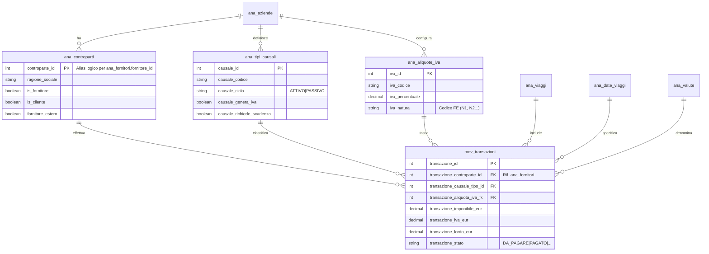

# 📘 MANUALE SISTEMA CONTABILE - GESTIONE VIAGGI OFFROAD

**Versione Sistema**: 2.0 (Febbraio 2026)
**Database**: PostgreSQL 17.5
**Stato**: Produzione

---

# INDICE

1. [Panoramica del Sistema](#1-panoramica-del-sistema)
2. [Modello Contabile Funzionale](#2-modello-contabile-funzionale)
    - [Ciclo Attivo vs Passivo](#21-ciclo-attivo-vs-passivo)
    - [Entità "Controparte" Unificata](#22-entità-controparte-unificata)
    - [Documenti e Causali](#23-documenti-e-causali)
3. [Gestione IVA e Fiscale](#3-gestione-iva-e-fiscale)
    - [Regole di Calcolo](#31-regole-di-calcolo-e-arrotondamento)
    - [Trattamento Valute Estere](#32-trattamento-valute-estere)
4. [Struttura Dati Tecnica (Riferimento Sviluppatori)](#4-struttura-dati-tecnica)
    - [Diagramma ER](#41-diagramma-er-entity-relationship)
    - [Schema Database](#42-schema-database-tabelle-chiave)
    - [View di Reportistica](#43-view-di-reportistica)
    - [Trigger Automatici](#44-trigger-automatici-e-business-logic)
5. [Guida Operativa](#5-guida-operativa)
    - [Registrazione Fattura Fornitore](#51-registrazione-fattura-fornitore-passiva)
    - [Emissione Fattura Cliente](#52-emissione-fattura-cliente-attiva)
    - [Gestione Pagamenti e Scadenze](#53-gestione-pagamenti-e-scadenze)

---

# 1. Panoramica del Sistema

Il sistema contabile di **Gestione Viaggi Offroad** è progettato per gestire in modo integrato sia il **Ciclo Passivo** (acquisti da fornitori) che il **Ciclo Attivo** (vendite a clienti/viaggiatori), permettendo un controllo completo sui flussi finanziari e sulla marginalità dei viaggi.

### Principi Fondamentali

1.  **Metadata-Driven**: Le regole di validazione (es. scadenze obbligatorie, calcolo IVA) non sono scritte nel codice ("hardcoded") ma configurate nel database (tabella `ana_tipi_causali`). Questo permette di modificare il comportamento del software agendo solo sui dati.
2.  **DB-Centric Integrity**: La logica di business critica (calcolo IVA, aggiornamento stati pagamento, validazione date) risiede nel database tramite **Trigger PostgreSQL**. Questo garantisce che i dati siano sempre coerenti, indipendentemente da chi li inserisce (App Web, script, importazioni massivi).
3.  **Primato del Documento**: Il sistema rispetta il principio che "il pezzo di carta vince sul calcolo matematico". L'utente può sempre forzare manualmente gli importi IVA/Lordo per allinearli esattamente ai documenti fiscali ricevuti, gestendo al centesimo gli arrotondamenti.

---

# 2. Modello Contabile Funzionale

## 2.1 Ciclo Attivo vs Passivo

Il sistema distingue due flussi principali, definiti a livello di causale contabile:

-   **CICLO PASSIVO (Fornitori)**:
    -   Riguarda costi, fatture ricevute, note di debito.
    -   Gli importi aumentano il debito verso il fornitore.
    -   Modalità IVA predefinita: **SCORPORO** (si parte dal totale lordo del documento).
    -   Causali tipiche: `FT` (Fattura Passiva), `ND` (Nota Debito).

-   **CICLO ATTIVO (Clienti)**:
    -   Riguarda ricavi, fatture emesse, note di credito.
    -   Gli importi aumentano il credito verso il cliente.
    -   Modalità IVA predefinita: **CALCOLO** (si parte dall'imponibile netto + IVA).
    -   Causali tipiche: `FV` (Fattura Vendita), `NDA` (Nota Debito Attiva).

## 2.2 Entità "Controparte" Unificata

Nel database non esistono tabelle separate per Fornitori e Clienti. Esiste un'unica entità logica **Controparte** (tabella fisica `ana_fornitori` adattata) che può assumere contemporaneamente entrambi i ruoli.

-   **Unicità**: Una società ("Hotel Paradise Srl") è inserita una sola volta.
-   **Ruoli**: Tramite flag (`is_fornitore`, `is_cliente`), si definisce come opera la controparte.
-   **Vantaggio**: Gestione centralizzata di anagrafica, P.IVA e contatti.

## 2.3 Documenti e Causali

Le causali (`ana_tipi_causali`) guidano il comportamento del sistema:

| Codice | Descrizione | Ciclo | Segno | Doc? | IVA? | Note Funzionali |
| :--- | :--- | :--- | :---: | :---: | :---: | :--- |
| **FT** | Fattura Passiva | PASSIVO | + | Sì | Sì | Richiede scadenza e IVA. Aumenta debito. |
| **ND** | Nota Debito | PASSIVO | + | Sì | Sì | Correzione a debito. |
| **NC** | Nota Credito | PASSIVO | - | Sì | No | Storno. Non genera nuova IVA (storna precedente). |
| **PG** | Pagamento | PASSIVO | - | No | No | Movimento finanziario. Chiude FT/ND. |
| **FV** | Fattura Attiva | ATTIVO | + | Sì | Sì | Richiede scadenza e IVA. Crea credito. |
| **IN** | Incasso | ATTIVO | - | No | No | Movimento finanziario. Chiude FV. |

---

# 3. Gestione IVA e Fiscale

## 3.1 Regole di Calcolo e Arrotondamento

Il sistema gestisce tre valori fondamentali per ogni transazione:
1.  **Imponibile** (Netto)
2.  **Importo IVA**
3.  **Lordo** (Totale)

### La Regola Aurea ("Il punto d'oro")
Se il calcolo matematico `Imponibile * 1.22` differisce dal totale della fattura cartacea (per arrotondamenti diversi), l'utente può inserire **manualmente** tutti e tre i valori. Il sistema accetta i valori manuali se la discrepanza matematica è inferiore a **0.01 €**, ma la coerenza contabile (Lordo = Imponibile + IVA) è garantita al centesimo.

### Automazione per Ciclo
-   Per **Fornitori** (Passivo): Inserisci il **Lordo** → Il sistema scorpora Imponibile e IVA.
-   Per **Clienti** (Attivo): Inserisci l'**Imponibile** → Il sistema somma l'IVA e calcola il Lordo.

## 3.2 Trattamento Valute Estere

L'IVA italiana (DPR 633/72) si applica solo alle transazioni in **EUR**.

-   **Valuta = EUR**: Campi IVA obbligatori (se la causale lo prevede). Calcolo automatico attivo.
-   **Valuta ≠ EUR** (es. USD, TND): L'IVA estera è considerata **costo puro** (Fuori Campo IVA art. 7-ter).
    -   I campi Imponibile/IVA vengono azzerati automaticamente.
    -   Tutto l'importo finisce nel "Lordo" come costo indetraibile.

---

# 4. Struttura Dati Tecnica

Questa sezione è destinata a sviluppatori e manutentori del database.

## 4.1 Diagramma ER (Entity-Relationship)

## 4.2 Schema Database: Tabelle Chiave

### `ana_controparti` (Fisicamente: `ana_fornitori`)
Tabella master per i soggetti fiscali.
> **Nota Tecnica**: La tabella fisica si chiama ancora `ana_fornitori` per motivi storici. Tutte le query e le view moderne dovrebbero trattarla semanticamente come Controparti.

Nuove colonne chiave:
-   `is_fornitore` (BOOL): Abilita uso nel ciclo passivo.
-   `is_cliente` (BOOL): Abilita uso nel ciclo attivo.
-   `fornitore_estero` (BOOL): Se TRUE, la P.IVA accetta formati esteri (VAT).

### `mov_transazioni`
Cuore del sistema contabile. Registro di tutti i movimenti.

Colonne importi (tutte `NUMERIC 10,2`):
-   `transazione_importo`: Importo grezzo inserito dall'utente.
-   `transazione_imponibile_eur`: Base imponibile netta.
-   `transazione_iva_eur`: Valore dell'imposta.
-   `transazione_lordo_eur`: Totale documento (Imponibile + IVA). **Questo è il valore contabile di riferimento**.

Relazioni:
-   `transazione_fattura_fk`: Per i pagamenti (`PG`/`IN`), punta alla transazione originale (`FT`/`FV`) che stanno saldando. Questo link permette di calcolare il residuo.

### `ana_aliquote_iva`
Tabella di configurazione aliquote (Multi-tenant).
-   `iva_codice`: Codice breve (es. '22', 'FC').
-   `iva_natura`: Codice per Fatturazione Elettronica (es. 'N4', 'N2.1').
-   `iva_percentuale`: Valore numerico (es. 22.00).

## 4.3 View di Reportistica

-   **`vw_partitario_fornitori` / `vw_partitario_clienti`**:
    -   Mostrano l'estratto conto.
    -   Saldo progressivo calcolato con Window Functions (`SUM() OVER (...)`).
    -   Il residuo è calcolato dinamicamente sottraendo i pagamenti collegati (`transazione_fattura_fk`) dal lordo.

-   **`vw_scadenzario`**:
    -   Filtra le transazioni non saldate (`transazione_stato IN ('DA_PAGARE', 'PARZIALMENTE_PAGATO')`).
    -   Ordina per urgenza (Scadute > Urgenti < 7gg > Future).

-   **`vw_margini_viaggi`**:
    -   Pivot dei dati per Viaggio.
    -   **Margine Lordo**: `(Ricavi Lordi) - (Costi Lordi)`.
    -   **Margine Netto**: `(Ricavi Imponibili) - (Costi Imponibili)`. Utile per analisi reddituale industriale.

## 4.4 Trigger Automatici e Business Logic

Il sistema si affida a trigger PostgreSQL (`plpgsql`) per l'integrità:

1.  **`trg_calcola_iva_transazione`**:
    -   Esegue calcoli matematici Imponibile/IVA/Lordo.
    -   Azzera IVA se valuta non è EUR.
    -   Rispetta input manuali se coerenti matematicamente.

2.  **`trg_validate_transazione_metadata`**:
    -   Impedisce salvataggio se manca scadenza su Fatture.
    -   Impedisce salvataggio senza IVA su documenti che la richiedono.
    -   Auto-calcola scadenza (`Data Documento + default giorni causale`) se omessa.

3.  **`trg_aggiorna_stato_pagamento`**:
    -   Quando si inserisce un `PG`, aggiorna lo stato della `FT` collegata (`PAGATO` o `PARZIALMENTE_PAGATO`).

---

# 5. Guida Operativa

## 5.1 Registrazione Fattura Fornitore (Passiva)

1.  Selezionare **Nuovo Movimento**.
2.  Scegliere Ciclo **PASSIVO** e Causale (es. **Fattura Fornitore**).
3.  Selezionare il **Fornitore** (il sistema filtra automaticamente solo le controparti marcate come fornitore).
4.  Inserire **Data Documento**, **Numero** e **Importo Totale** (Lordo).
5.  Il sistema scorpora automaticamente l'IVA 22%. Se la fattura ha un'aliquota diversa (es. 10%), cambiarla nel menu a tendina.
6.  Verificare la **Data Scadenza** (calcolata in automatico a 30/60gg in base alla configurazione, ma modificabile).
7.  Salvare.

## 5.2 Emissione Fattura Cliente (Attiva)

1.  Selezionare **Nuovo Movimento**.
2.  Scegliere Ciclo **ATTIVO** e Causale (es. **Fattura Vendita**).
3.  Selezionare il **Cliente**.
4.  Inserire l'**Importo Imponibile** (Netto del servizio).
5.  Il sistema aggiunge l'IVA e calcola il totale lordo da incassare.
6.  Salvare.

## 5.3 Gestione Pagamenti e Scadenze

Per registrare un pagamento:

1.  Andare sullo **Scadenzario** o sulla griglia movimenti.
2.  Individuare la fattura da pagare.
3.  Cliccare sull'icona **Paga / Incassa** (💰).
4.  Nel dialog, confermare l'importo (proposto il residuo totale) e la data.
    -   È possibile registrare pagamenti parziali (acconti).
5.  Il sistema crea automaticamente una transazione di tipo `PG` (o `IN`) collegata e aggiorna lo stato della fattura originale.
