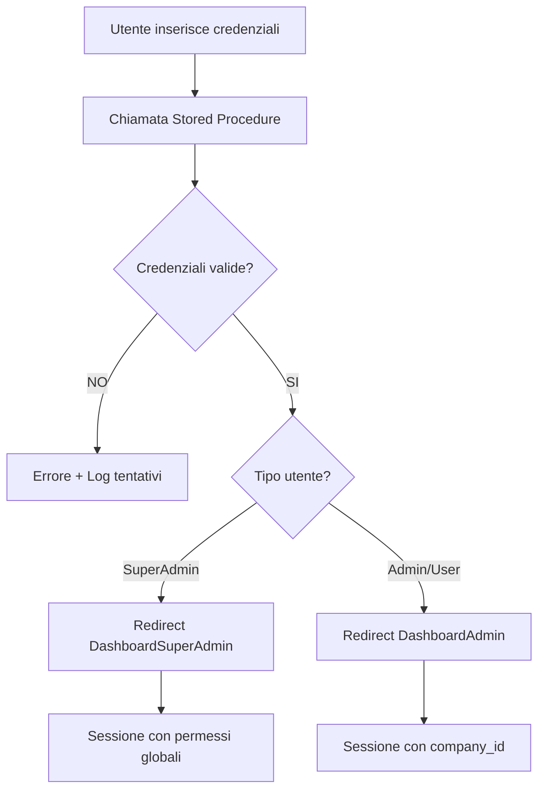

# 🔐 Sistema di Autenticazione - Gestione Viaggi

**Progetto**: Gestione Viaggi Offroad
**Database**: PostgreSQL 17.5 su Docker
**Ultimo aggiornamento**: 16/12/2024

---

## 📋 Requisiti Funzionali

### 1. Sistema Multi-Azienda

L'applicazione gestisce più aziende con isolamento dei dati:

- **Utenti Standard**: legati ad una specifica azienda, vedono solo i dati della propria azienda
- **SuperAdmin**: utente speciale con accesso completo a tutte le aziende e tutti i dati
  - Ha grant totali su tutte le tabelle
  - Accede a dashboard dedicata con visibilità globale

### 2. Tipologie di Utenti e Dashboard

#### 2.1 SuperAdmin
- **Username**: `superadmin` (già presente nel DB)
- **Caratteristiche**:
  - Visibilità totale su tutte le aziende
  - Accesso completo a tutte le tabelle
  - Non soggetto a filtri per `company_id`
- **Dashboard**: `DashboardSuperAdmin.razor`
- **Menu**: Accesso completo senza restrizioni da `sys_menu_role_grants`

#### 2.2 Admin/Utente Aziendale
- **Caratteristiche**:
  - Legato ad una specifica azienda via `company_id`
  - Vede solo i dati della propria azienda
  - Permessi basati su ruoli e tabelle `sys_menu_*`
- **Dashboard**: `DashboardAdmin.razor`
- **Menu**: Filtrato in base a `sys_menu_role_grants` e `sys_menu_items`

### 3. Flusso di Autenticazione



---

## 🗄️ Struttura Database

### Tabelle Coinvolte

#### Core Autenticazione
1. **`app_users`**: Dati utente (username, email, password_hash, salt)
2. **`user_roles`**: Ruoli disponibili (SuperAdmin, Admin, User, ecc.)
3. **`app_user_role_map`**: Mapping utente → ruoli

#### Sicurezza Password
4. **`password_reset_tokens`**: Token per reset password
5. **`password_reset_attempts`**: Tracking tentativi reset
6. **`password_reset_results`**: Log risultati reset

#### Permessi Menu (Non per SuperAdmin)
7. **`sys_menu_items`**: Voci di menu disponibili
8. **`sys_menu_role_grants`**: Permessi menu per ruolo

#### Configurazioni (Opzionale)
9. **`user_table_settings`**: Preferenze utente per tabelle (non usato per login)

### Stored Procedures di Autenticazione

**IMPORTANTE**: Usare ESCLUSIVAMENTE le stored procedures esistenti per motivi di sicurezza e crittografia.

#### Principali SP da utilizzare:
```sql
-- Autenticazione utente
CALL sp_authenticate_user(p_username, p_password);

-- Verifica sessione
CALL sp_verify_session(p_session_token);

-- Logout
CALL sp_logout_user(p_user_id, p_session_token);

-- (Futuro) Reset password
CALL sp_request_password_reset(p_email);
CALL sp_validate_reset_token(p_token);
CALL sp_reset_password(p_token, p_new_password);
```

**TODO**: Documentare parametri input/output di ogni SP dopo analisi DB

---

## 🔌 Connessione Database

### Configurazione Attuale (Docker Locale)

```json
{
  "ConnectionStrings": {
    "PostgreSQL": "Host=127.0.0.1;Port=5432;Database=gestione_viaggi;Username=postgres;Password=postgres;Pooling=true;MinPoolSize=1;MaxPoolSize=20;"
  }
}
```

### Configurazione Futura (Neon Cloud con SSL)

```json
{
  "ConnectionStrings": {
    "PostgreSQL": "Host=<neon-host>;Port=5432;Database=gestione_viaggi;Username=<user>;Password=<pwd>;SslMode=Require;Trust Server Certificate=true;Pooling=true;"
  }
}
```

**Libreria**: `Npgsql` (Provider PostgreSQL per .NET)

---

## 🎨 UI/UX - Pagina Login

### Design Requirements

#### Layout
- **Stile**: Pulito, professionale, minimal (ispirato a login moderni)
- **Responsive**: Centrato, con card/panel arrotondato
- **Elementi**:
  1. Logo aziendale (da fornire)
  2. Immagine di sfondo/hero (da fornire)
  3. Form login con:
     - Campo "Nome utente" (label in italiano)
     - Campo "Password" (label in italiano, con toggle visibilità)
     - Checkbox "Ricordami" (opzionale)
     - Bottone "Accedi" (primario, con loading spinner)
     - Link "Password dimenticata?" (per ora non funzionante)

#### Stile Visivo
- **Tema CSS**: Utilizzare `premium-saas-ULTRA-SPECIFIC.css` esistente
- **Colori**:
  - Light mode: #FFFFFF (sfondo), #111827 (testo), #F7F8FA (bordi)
  - Dark mode: #30333B (sfondo), #E6E8EB (testo)
- **Font**: Inter, 14px per campi, 16px per titoli
- **Bordi**: Border-radius 8px, ombre soft
- **Animazioni**: Transizioni smooth su focus/hover

#### Validazione
- Validazione client-side:
  - Username: obbligatorio, min 3 caratteri
  - Password: obbligatoria, min 8 caratteri
- Messaggi errore in italiano:
  - "Credenziali non valide"
  - "Account bloccato per troppi tentativi"
  - "Errore di connessione al server"

---

## 🔐 Gestione Sessione e Sicurezza

### 1. Autenticazione
- ✅ Password hashate con salt (gestito da SP PostgreSQL)
- ✅ Protezione contro SQL injection (uso SP + parametri)
- ✅ Rate limiting tentativi login (tracking su `password_reset_attempts`)
- ⚠️ Token JWT o session token persistente (da implementare)

### 2. Autorizzazione
```csharp
public class UserSession
{
    public int UserId { get; set; }
    public string Username { get; set; }
    public string Email { get; set; }
    public int? CompanyId { get; set; } // NULL per SuperAdmin
    public List<string> Roles { get; set; } // ["SuperAdmin"] o ["Admin", "User"]
    public bool IsSuperAdmin => Roles.Contains("SuperAdmin");
    public DateTime LoginTime { get; set; }
    public string SessionToken { get; set; }
}
```

### 3. Protezione Route
- Middleware/AuthenticationStateProvider personalizzato
- Redirect a `/login` se non autenticato
- Redirect a dashboard corretta in base a ruolo

---

## 📁 Struttura File da Creare

```
Components/
├── Pages/
│   ├── Login.razor                    # Pagina login
│   ├── DashboardSuperAdmin.razor      # Dashboard admin globale
│   └── DashboardAdmin.razor           # Dashboard aziendale
├── Shared/
│   └── LoginLayout.razor              # Layout minimal per login (no sidebar)
Services/
├── Authentication/
│   ├── IAuthenticationService.cs      # Interfaccia servizio auth
│   ├── AuthenticationService.cs       # Implementazione con SP PostgreSQL
│   ├── CustomAuthStateProvider.cs    # Gestione stato autenticazione
│   └── UserSession.cs                 # Modello sessione utente
├── Database/
│   ├── IDatabaseService.cs
│   └── PostgreSqlService.cs           # Connessione e chiamate SP
Models/
├── LoginRequest.cs
├── LoginResponse.cs
└── UserInfo.cs
```

---

## 🚀 Roadmap Implementazione

### Fase 1: Setup Database (✅ Già esistente)
- [x] PostgreSQL su Docker
- [x] Stored procedures autenticazione
- [x] Tabelle utenti e ruoli

### Fase 2: Connessione e Servizi
- [ ] Configurare Npgsql in `appsettings.json`
- [ ] Creare `PostgreSqlService` per connessione
- [ ] Implementare `AuthenticationService` con chiamate SP
- [ ] Creare `CustomAuthStateProvider`

### Fase 3: UI Login
- [ ] Creare `LoginLayout.razor` (no sidebar)
- [ ] Implementare `Login.razor` con validazione
- [ ] Styling con CSS premium esistente
- [ ] Gestione errori e loading states

### Fase 4: Dashboard e Routing
- [ ] Creare `DashboardSuperAdmin.razor`
- [ ] Creare `DashboardAdmin.razor`
- [ ] Configurare routing protetto
- [ ] Implementare menu dinamico basato su ruoli

### Fase 5: Testing
- [ ] Test login SuperAdmin
- [ ] Test login utente aziendale
- [ ] Test sessione persistente
- [ ] Test protezione route

### Fase 6: Password Reset (Futuro)
- [ ] UI "Password dimenticata"
- [ ] Integrazione mail server
- [ ] Flow completo reset password

### Fase 7: Migrazione Cloud
- [ ] Configurazione SSL per Neon
- [ ] Test connessione remota
- [ ] Update connection string

---

## 📝 Note Tecniche

### Librerie da Aggiungere
```xml
<PackageReference Include="Npgsql" Version="8.0.1" />
<PackageReference Include="Microsoft.AspNetCore.Components.Authorization" Version="9.0.0" />
```

### Configurazione Dependency Injection (MauiProgram.cs)
```csharp
builder.Services.AddScoped<IDatabaseService, PostgreSqlService>();
builder.Services.AddScoped<IAuthenticationService, AuthenticationService>();
builder.Services.AddScoped<AuthenticationStateProvider, CustomAuthStateProvider>();
builder.Services.AddAuthorizationCore();
```

### Sicurezza
- ⚠️ **MAI** salvare password in chiaro
- ⚠️ Usare SOLO stored procedures per autenticazione
- ⚠️ Validare input lato client E server
- ⚠️ Implementare HTTPS obbligatorio in produzione
- ⚠️ Session token con scadenza (es. 24h)

---

## 🔗 Link Utili

- [Npgsql Documentation](https://www.npgsql.org/doc/index.html)
- [Blazor Authentication](https://learn.microsoft.com/en-us/aspnet/core/blazor/security/)
- [PostgreSQL Stored Procedures](https://www.postgresql.org/docs/current/sql-createprocedure.html)

---

**Prossimi Step**:
1. Analizzare stored procedures esistenti nel DB
2. Configurare connessione PostgreSQL
3. Implementare servizi autenticazione
4. Creare UI login
