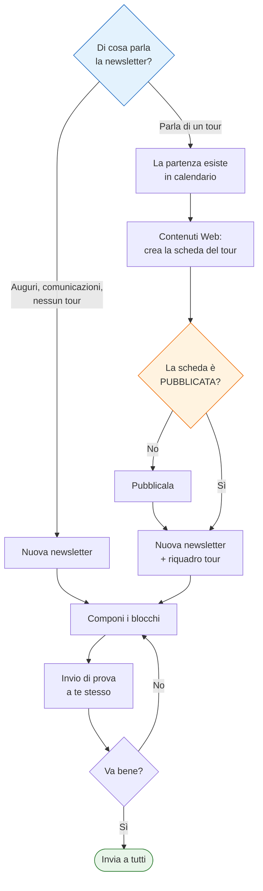

# Manuale d'uso — Newsletter

*Versione 2.0 — Estensione Web · aggiornato all'11 agosto 2026*

---

## In due righe

Una newsletter **non ha bisogno di alcun viaggio**. Va a tutti i clienti dell'azienda che hanno
dato il consenso commerciale, e può contenere qualunque cosa: auguri di Natale, un cambio di sede,
la presentazione della stagione.

Un viaggio serve **solo se vuoi collegare un tour** — un riquadro che ne mostra foto, date e
descrizione, o un pulsante che porta alla sua pagina sul sito. In quel caso, e solo in quello, ci
sono dei passi da fare **prima**, e questo manuale serve soprattutto a metterli in ordine.

> **Attenzione a non rovesciare la frase.** Non è vero che *«una partenza senza contenuti web non
> può avere una newsletter»*. È vero che **una newsletter non può collegarsi a una partenza che non
> ha una scheda di contenuti web pubblicata**. La differenza conta: la newsletter viene prima, il
> tour è un contenuto che *puoi* metterci dentro.

---

## Indice

1. [Le due strade](#1-le-due-strade)
2. [Cosa serve una volta sola](#2-cosa-serve-una-volta-sola)
3. [Strada A — Newsletter senza tour](#3-strada-a--newsletter-senza-tour)
4. [Strada B — Newsletter che parla di un tour](#4-strada-b--newsletter-che-parla-di-un-tour)
5. [Comporre: i blocchi](#5-comporre-i-blocchi)
6. [Modelli: non ricominciare da capo](#6-modelli-non-ricominciare-da-capo)
7. [Prima di spedire](#7-prima-di-spedire)
8. [Cosa non si può fare, e perché](#8-cosa-non-si-può-fare-e-perché)
9. [I messaggi che puoi incontrare](#9-i-messaggi-che-puoi-incontrare)

---

## 1. Le due strade

Prima di aprire il programma, decidi di cosa parla la newsletter. Le due strade hanno prerequisiti
diversi, e imboccare la seconda senza aver preparato il terreno è la causa più frequente di lavoro
buttato.

| | **A — Senza tour** | **B — Con un tour** |
|---|---|---|
| **Esempi** | Auguri di Natale, cambio sede, nuovo numero di telefono, presentazione della stagione | «Autunno in fuoristrada», partenza di Pasqua, ultimi posti per il ponte |
| **Serve una partenza in calendario?** | **No** | Sì |
| **Serve una scheda di contenuti web?** | **No** | Sì, e **pubblicata** |
| **Si può fare subito?** | **Sì** | Solo dopo i passi del capitolo 4 |
| **Chi la riceve** | Tutti i clienti con consenso commerciale | Gli stessi. I destinatari **non dipendono mai dal viaggio** |

**I destinatari sono sempre gli stessi.** Non esiste «mandare la newsletter ai partecipanti di quel
viaggio»: la newsletter è uno strumento commerciale e va a chi ha acconsentito a riceverla.

---

## 2. Cosa serve una volta sola

Da fare una volta per azienda, non a ogni newsletter.

| Cosa | Dove | Se manca |
|---|---|---|
| **Sito web dell'azienda** | Anagrafica Aziende | **L'invio è bloccato.** Il link di disiscrizione si costruisce dall'indirizzo del sito: senza, la mail partirebbe senza un modo per cancellarsi, e la legge lo richiede |
| **Logo** | Anagrafica Aziende | La mail parte senza intestazione. Viene chiesta conferma |
| **Parametri di posta (SMTP)** | Impostazioni → Newsletter | Non si spedisce nulla |
| **Consenso commerciale dei clienti** | Scheda cliente | Chi non l'ha dato **non riceve niente** e non compare fra i destinatari |
| **Indirizzi ricorrenti** | Tabelle → Tabelle web → Indirizzi web | Facoltativo. Registra qui i link che usi spesso (sito, Facebook, Instagram): li ritrovi nella tendina dei pulsanti invece di ricordarli a memoria |
| **Immagini e icone** | Tabelle → Tabelle web → Libreria immagini | Facoltativo, ma comodo: le immagini che riusi (icone, loghi, separatori) stanno qui e non nelle gallerie dei viaggi |

---

## 3. Strada A — Newsletter senza tour

È il caso degli auguri di Natale. **Non serve nessuna preparazione** oltre al capitolo 2.

1. **Newsletter → Nuova newsletter**
2. Scrivi l'**oggetto** — è la riga che il destinatario legge nella posta in arrivo.
3. Scegli **Vuota** (oppure un modello, vedi capitolo 6).
4. Componi i blocchi: testata con un'immagine, uno o più testi, immagini, pulsanti verso il sito.
5. **Invio di prova** a te stesso.
6. **Invia a tutti**.

Nessuna verifica sui tour scatterà, perché non ce ne sono. Quello che leggi al capitolo 8 sulle
partenze non ti riguarda.

---

## 4. Strada B — Newsletter che parla di un tour

**L'ordine conta.** Ogni passo saltato si paga più avanti, e più avanti costa di più.

### Passo 1 — La partenza esiste in calendario

Anagrafiche → Viaggi → Date di partenza. Senza una partenza non c'è niente a cui agganciarsi.

### Passo 2 — La partenza ha una scheda di contenuti web

Contenuti Web → scegli il viaggio e la partenza → **Crea** (o **Clona** da un'altra partenza dello
stesso viaggio).

Qui si scrivono titolo, descrizione, foto, itinerario giorno per giorno. È **la stessa scheda che
alimenta il sito pubblico**: non è materiale scritto per la newsletter, è il contenuto del tour.

> **Se salti questo passo**, quando proverai a inserire il tour nella newsletter leggerai
> *«Questa partenza non ha una scheda di contenuti web: creala prima di inserirla in newsletter»*,
> e non potrai andare avanti.

### Passo 3 — La scheda è **pubblicata**

Sempre in Contenuti Web, stato **pubblicato**. Una scheda in bozza non esiste sul sito: il
collegamento della newsletter porterebbe a una pagina inesistente.

> **Se salti questo passo**, componi tutto tranquillamente ma **l'invio a tutti viene bloccato**
> con un messaggio che dice quale blocco e perché. L'invio di prova invece parte, con un avviso:
> serve proprio a farti vedere com'è venuta prima di pubblicare.

### Passo 4 — Componi la newsletter

Newsletter → Nuova newsletter → aggiungi un **riquadro tour** (o un **pulsante** verso la pagina
del tour) → **Scegli il tour** → seleziona la partenza.

Titolo, periodo («Dal 2 al 7 maggio 2026»), immagine di copertina e collegamento vengono compilati
da soli, **e restano modificabili**: la compilazione automatica precompila, non blocca. Se il
riquadro conteneva già dei testi ti viene chiesto se sostituirli.

### Passo 5 — Prova, verifica, invio

Vedi capitolo 7.

---

## 5. Comporre: i blocchi

Una newsletter è una pila di blocchi, che si riordinano trascinandoli.

| Blocco | A cosa serve | Note |
|---|---|---|
| **Intestazione** | Logo dell'azienda | C'è sempre, si compila da sola |
| **Testata** | Immagine grande, titolo, sottotitolo | L'immagine può essere cliccabile. Non ha pulsante |
| **Testo** | Un paragrafo scritto da te | Grassetto, corsivo, elenchi, colori |
| **Riquadro informativo** | Icona a fianco + titolo e testo | «Chi può partecipare», «Cosa serve». L'icona sta a sinistra o a destra |
| **Riquadro tour** | Foto, titolo, date e descrizione di una partenza | Richiede i passi del capitolo 4 |
| **Immagine** | Una foto a tutta larghezza | Può avere un collegamento e un pulsante, con posizione propria |
| **Pulsante** | Un bottone | Fino a **tre in fila**, ognuno con la sua posizione (sinistra, centro, destra) |
| **Separatore** | Una riga | Per dare respiro |
| **Piè di pagina** | Dati aziendali e link di disiscrizione | C'è sempre. Il link di disiscrizione **non è modificabile**: è un obbligo di legge |

**Colori.** Titolo e sottotitolo hanno un colore scegliendo per nome («Blu del modello», «Rosso»).
*Predefinito* non è la stessa cosa che scegliere il blu a mano: un blocco lasciato su predefinito
segue il modello grafico anche se il modello cambia.

**Collegamenti.** Ogni immagine o pulsante può portare da qualche parte, **o da nessuna parte**: la
prima voce della tendina è *Nessun collegamento*, ed è quella giusta per un'immagine decorativa.

**Immagini con del testo dentro: evitale.** Il testo dentro un'immagine non viene tradotto e
resterebbe in italiano nelle mail agli stranieri.

---

## 6. Modelli: non ricominciare da capo

Le newsletter di un'azienda si assomigliano quasi tutte. Un **modello** è una newsletter salvata per
essere riusata: struttura, blocchi, colori, disposizione.

**Come nasce un modello.** Quasi sempre da una newsletter venuta bene: nell'elenco, l'icona a forma
di **segnalibro** → dai un nome che ti ricordi a cosa serve («Ponte di Pasqua», «Ferie estive»,
«Auguri di Natale»). L'originale resta dov'era; il modello è una copia.

**Come si usa.** Nuova newsletter → **Da un modello**. Se ne hai almeno uno, è già selezionato.

**Un modello non si spedisce**, si duplica. Il pulsante Invia resta bloccato apposta.

### Il riaggancio della partenza

Se il modello (o la newsletter che stai duplicando) contiene blocchi agganciati a una partenza,
**subito dopo ti viene chiesto a quale tour agganciarli**, uno per uno, dicendoti di quale blocco si
tratta.

Serve a evitare un errore che nessuno noterebbe: un modello «Pasqua» riusato l'anno dopo punterebbe
al viaggio dell'anno prima, con le date vecchie nel sottotitolo, e sembrerebbe giusto.

Puoi **saltare** un blocco: resta agganciato a com'era, e ti viene detto quanti ne restano da
sistemare. Lo aggiusti componendo.

---

## 7. Prima di spedire

### Anteprima

Mostra la mail vera, non un'approssimazione. Le immagini si vedono solo se il loro indirizzo è
raggiungibile pubblicamente. Il browser però non è un programma di posta: per una verifica seria
serve il passo successivo.

### Invio di prova

A un indirizzo tuo. **Fallo sempre.** È l'unico modo di vedere come la mail arriva davvero — Outlook
per Windows è il caso più severo.

Accanto all'indirizzo scegli la **lingua**: la prova arriva tradotta come la riceverebbe un
destinatario straniero, oggetto compreso, e i testi non ancora tradotti restano in italiano. Così
controlli la resa in tedesco o in spagnolo senza spedire a nessuno.

Se un collegamento a un tour non funziona, la prova **parte lo stesso** e ti avvisa: comporre la
newsletter prima di pubblicare la scheda del tour è una sequenza legittima.

### Invia a tutti

**Le traduzioni devono essere complete.** Se una lingua che qualcuno riceverà non è pronta — mancano
dei testi, oppure ne hai modificati alcuni dopo averli tradotti — l'invio **non parte**, e il messaggio
ti dice quale lingua e quanto manca (es. «DE 5/6»). Hai due strade: completare la traduzione, oppure
togliere dai destinatari le lingue non pronte. Una lingua incompleta ma **senza destinatari** non
blocca nulla.

È una scelta deliberata: una mail per metà in tedesco e per metà in italiano arriva a un cliente vero
e non si richiama indietro.

Prima di partire il programma controlla anche, e **blocca** se:

- l'azienda non ha un sito web (link di disiscrizione impossibile);
- un blocco è vuoto;
- due pulsanti della stessa fila occupano la stessa posizione;
- **un collegamento a un tour non porta più da nessuna parte** — scheda cancellata, o non pubblicata.

In quest'ultimo caso il messaggio dice **la posizione e il nome del blocco**. Il conteggio dei
destinatari è quello dei clienti con consenso commerciale.

**Una newsletter inviata non si modifica e non si elimina**: è la prova documentale di cosa hai
spedito e a chi, e serve anche a rispondere a una contestazione. Per rifarla, duplicala.

---

## 8. Cosa non si può fare, e perché

| Cosa | Si può? | Perché |
|---|---|---|
| Modificare una newsletter già inviata | **No** | È la prova di cosa è stato spedito. Duplicala |
| Eliminare una newsletter già inviata | **No** | Come sopra, con il suo elenco di destinatari |
| Eliminare una newsletter in bozza | Sì | Sparisce con tutti i suoi blocchi |
| Spedire un modello | **No** | Un modello si duplica |
| **Eliminare la scheda web di un tour** citato da una newsletter **in bozza** | **No** | La bozza resterebbe con un collegamento morto e nessuno se ne accorgerebbe. Il messaggio dice **quale** newsletter lo impedisce: togli o riaggancia quel blocco |
| Eliminare la scheda web di un tour citato solo da newsletter **già inviate** | Sì | Le mail spedite sono congelate: testo, immagine e indirizzo sono copie dentro la newsletter e non si rompono |
| **Eliminare una partenza** che ha una scheda di contenuti web | **No** | Elimina prima la scheda — e vale la riga sopra |
| Eliminare una partenza già iniziata o segnata come effettuata | **No** | È storico aziendale |
| Eliminare un'immagine della libreria usata in una newsletter | **No** | Il messaggio dice in quali |

---

## 9. I messaggi che puoi incontrare

| Messaggio | Cosa è successo | Cosa fare |
|---|---|---|
| *«Questa partenza non ha una scheda di contenuti web»* | Stai inserendo in newsletter un tour che sul sito non esiste | Contenuti Web → crea la scheda (capitolo 4, passo 2) |
| *«La scheda web di quel tour non è pubblicata»* | La scheda esiste ma è in bozza | Pubblicala. La prova parte lo stesso, l'invio a tutti no |
| *«Punta a un tour che non esiste più sul sito»* | Il collegamento porta a una pagina cancellata | Riaggancia il blocco a una partenza esistente, o togli il collegamento |
| *«Questa azienda non ha un sito web»* | Manca l'indirizzo in Anagrafica Aziende | Compilalo: senza, il link di disiscrizione è impossibile |
| *«Impossibile eliminare la scheda web: le newsletter … non ancora spedite puntano a questa partenza»* | Stai cancellando la scheda di un tour citato da una bozza | Apri quella newsletter, togli o riaggancia il blocco |
| *«Il blocco … è vuoto»* | Un blocco senza contenuto | Compilalo o eliminalo |
| *«… occupano entrambi la posizione …»* | Due pulsanti della stessa fila nella stessa casella | Cambia la posizione di uno dei due |
| *«Una newsletter già inviata non può essere eliminata»* | — | Vedi capitolo 8 |

---

## Riepilogo — l'ordine giusto

Il salto più comune è il passaggio **E**: la scheda c'è ma è rimasta in bozza. Non impedisce di
comporre — impedisce di spedire.
