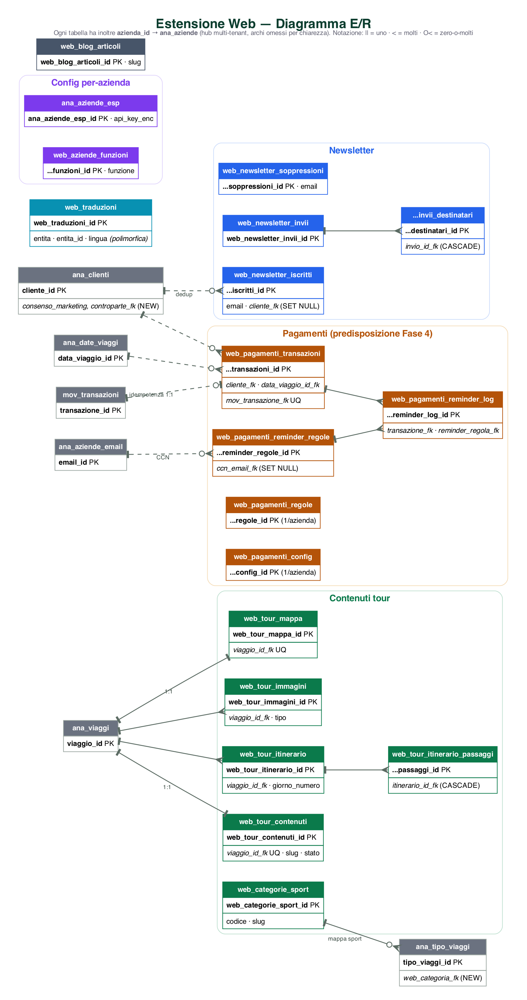

# Dettaglio Tabelle DB — Estensione Web — DOCUMENTO INTERNO
## Progetto SFT · companion di `Analisi Tecnica Dettagliata.md`

> 🔧 **USO INTERNO (Adriano + AI).** Spec **campo-per-campo** delle modifiche al DB. Verificato sul DB reale (PostgreSQL **17.7**, Docker `postgres_db`, db `gestione_viaggi`).
> **Versione:** 1.0 · **Data:** 20 Giugno 2026

> ## ⚙️ STATO AS-BUILT — aggiornamento 2026-07-03
> Lo schema è stato **implementato e deployato in locale** (branch `feature/estensione-web`, script `406`–`430`; funzioni CRUD da `431`). Convenzioni confermate: ogni tabella con `azienda_id` + audit + trigger condiviso `trg_web_audit()` + RLS `superadmin_bypass_all`. **Deviazioni rispetto a questa spec, decise durante l'implementazione** (celle qui sotto già aggiornate):
> - **§1.3** `ana_tipo_viaggi.web_categoria_fk` → **`BIGINT`** (non INTEGER): la PK `web_categorie_sport_id` è `BIGINT` identity. Regola generale: FK verso PK `web_*` = `BIGINT`, verso PK `ana_*` = `INTEGER`.
> - **§1.4** `ana_clienti.controparte_fk` → aggiunta **senza FK** (predisposizione): la tabella `ana_fornitori` citata **non esiste**; target reale = `ana_controparti(controparte_id)`; il vincolo si aggiunge in **Fase 4**.
> - **§2.17** `web_pagamenti_transazioni.mov_transazione_fk` → **`INTEGER`** (non BIGINT) con **FK reale** a `mov_transazioni(transazione_id)` (PK legacy INTEGER) e **`UNIQUE`** (idempotenza 1:1).
> - **Aggiunte da review** (`SqlScripts/430`): `CHECK lingua IN ('IT','FR','EN','DE','ES')` su `web_newsletter_iscritti`, `web_newsletter_invii_destinatari`, `web_pagamenti_reminder_log`; `ON DELETE SET NULL` su `web_newsletter_iscritti.cliente_fk` e `web_pagamenti_reminder_regole.ccn_email_fk`.

---

## CONVENZIONI (valgono per tutte le tabelle nuove)

- **PK nuove tabelle:** `<tabella>_id BIGINT GENERATED ALWAYS AS IDENTITY PRIMARY KEY`.
- **Multi-tenant:** `azienda_id INTEGER NOT NULL REFERENCES ana_aziende(azienda_id) ON DELETE RESTRICT` su ogni tabella di dominio. **Policy RLS** coerenti con l'esistente `superadmin_bypass_all` **+** una policy di **sola lettura per il ruolo pubblico/anon** limitata ai contenuti `stato_pubblicazione='pubblicato'` (e che nega tutto il resto).
- **Audit (ogni tabella):** `created_by VARCHAR(50) NOT NULL`, `created TIMESTAMPTZ NOT NULL DEFAULT now()`, `updated_by VARCHAR(50)`, `updated TIMESTAMPTZ` (+ trigger di audit come le tabelle esistenti).
- **Email:** tipo `CITEXT` (case-insensitive, come `ana_aziende_smtp.from_email`).
- **Lingua:** `CHAR(2)` con CHECK in `('IT','FR','EN','DE','ES')`.
- **Segreti (API key, chiavi Stripe, ESP):** colonna `JSONB` cifrata **lato applicazione** (stesso pattern di `ana_aziende_smtp.password_enc` — niente chiavi in chiaro nel DB).
- **Immagini web e mappe:** **NON** in `bytea`. Si caricano su **Supabase Storage** (bucket pubblico) e nel DB si salva l'**URL pubblico** + lo `storage_path`. *(Diverso dal pattern bytea del gestionale: serve per delivery via CDN.)*
- **Enum:** realizzati con `VARCHAR(n) + CHECK` (come `data_viaggio_effettuato_sino`).
- **Accesso:** tutto via **funzioni PL/pgSQL** (DB-First) + documentazione in `Funzioni_DB.md`. Script numerati in `SqlScripts/`.
- **Importi pagamenti:** in **centesimi** (`INTEGER`, unità minima Stripe) + `valuta CHAR(3) DEFAULT 'EUR'`.

---

## DIAGRAMMA E/R (as-built, 2026-07-03)

> Panoramica delle 19 nuove tabelle e dei legami di dominio con le tabelle esistenti (grigio). **Nota:** ogni tabella ha inoltre `azienda_id → ana_aziende` (hub multi-tenant, archi omessi per chiarezza). `web_traduzioni` è **polimorfica** (nessuna FK verso l'entità tradotta). Notazione crow's-foot: `||`=uno, `<`=molti, `O<`=zero-o-molti; **tratteggio** = FK opzionale/nullable.

*Versione vettoriale (zoom senza perdita di qualità): [`assets/er_estensione_web.svg`](assets/er_estensione_web.svg). Sorgente editabile Graphviz: [`assets/er_estensione_web.dot`](assets/er_estensione_web.dot) — rigenera con `dot -Tpng -Gdpi=150 assets/er_estensione_web.dot -o assets/er_estensione_web.png`.*

---

# PARTE 1 — TABELLE ESISTENTI DA MODIFICARE

## 1.1 `ana_clienti` — aggiunta consenso marketing
*Motivo: oggi non c'è alcuna base di consenso (vedi §8.3 analisi).*

| Campo (NUOVO) | Tipo | Null | Default | Note |
|---|---|---|---|---|
| `consenso_marketing` | BOOLEAN | NOT NULL | `false` | consenso all'invio newsletter/marketing |
| `consenso_marketing_data` | TIMESTAMPTZ | NULL | — | quando è stato raccolto |
| `consenso_marketing_fonte` | VARCHAR(30) | NULL | — | es. `iscrizione`, `gestionale`, `import` |

*Nessuna modifica ad altri campi/constraint esistenti.*

## 1.2 `ana_aziende` — token per il link iscrizione
*Motivo: generare dal gestionale l'URL `/<azienda_id>-<token>/` dell'app iscrizioni (token oggi solo nel `.env` Flask su Hetzner).*

| Campo (NUOVO) | Tipo | Null | Default | Note |
|---|---|---|---|---|
| `token_iscrizione` | VARCHAR(64) | NULL | — | token URL app iscrizioni, per-azienda. Da allineare al valore usato da Flask |

## 1.3 `ana_tipo_viaggi` — mappatura categoria "Sport" web
*Motivo: 7 tipi tecnici → categorie web (Fuoristrada/Quad/Moto Enduro/Moto Stradale), senza testo libero (§5.2-D).*

| Campo (NUOVO) | Tipo | Null | Default | Note |
|---|---|---|---|---|
| `web_categoria_fk` | **BIGINT** | NULL | — | FK → `web_categorie_sport(web_categorie_sport_id)` ON DELETE SET NULL *(as-built: BIGINT per allinearsi alla PK identity)* |

## 1.4 `ana_clienti` — collegamento alla contabilità *(DECISO: creazione al primo incasso)*
*Motivo: per far confluire gli incassi Stripe nella contabilità serve collegare il cliente-viaggio (`ana_clienti`) alla controparte fiscale (`ana_controparti` / fisicamente `ana_fornitori`).*

| Campo (NUOVO) | Tipo | Null | Default | Note |
|---|---|---|---|---|
| `controparte_fk` | INTEGER | NULL | — | *(as-built: colonna SENZA FK, predisposizione Fase 4)* Target reale = **`ana_controparti(controparte_id)`** (`ana_fornitori` NON esiste). **La controparte si crea/abbina al PRIMO incasso** e il link si **memorizza qui**, per riusarlo al saldo (niente controparti duplicate). FK aggiunta in Fase 4. |

---

# PARTE 2 — NUOVE TABELLE

> Tutte con `azienda_id` + audit (omessi nelle tabelle per brevità: si intendono presenti come da Convenzioni). PK = `<tabella>_id BIGINT IDENTITY`.

## 2.1 `web_categorie_sport` — categorie "Sport" del sito
| Campo | Tipo | Null | Default | Note |
|---|---|---|---|---|
| `web_categorie_sport_id` | BIGINT IDENTITY | NOT NULL | — | **PK** |
| `azienda_id` | INTEGER | NOT NULL | — | FK ana_aziende |
| `codice` | VARCHAR(20) | NOT NULL | — | es. `FUORISTRADA`, `QUAD`, `MOTO_ENDURO`, `MOTO_STRADALE` |
| `etichetta` | VARCHAR(50) | NOT NULL | — | testo IT mostrato (es. "Fuoristrada") |
| `slug` | VARCHAR(50) | NOT NULL | — | per URL categoria |
| `ordine` | INTEGER | NOT NULL | `0` | |

*Unique:* `(azienda_id, codice)`, `(azienda_id, slug)`.

## 2.2 `web_tour_contenuti` — contenuti editoriali del tour (1:1 con `ana_viaggi`)
| Campo | Tipo | Null | Default | Note |
|---|---|---|---|---|
| `web_tour_contenuti_id` | BIGINT IDENTITY | NOT NULL | — | **PK** |
| `viaggio_id_fk` | INTEGER | NOT NULL | — | **UNIQUE**, FK → `ana_viaggi(viaggio_id)` |
| `azienda_id` | INTEGER | NOT NULL | — | |
| `sottotitolo` | VARCHAR(255) | NULL | — | es. "Selvaggia Sardegna" |
| `descrizione_html` | TEXT | NULL | — | RichText (riassunto 2-3 righe) |
| `difficolta` | VARCHAR(20) | NULL | — | CHECK `('turistica','media','medio_alta','alta')` |
| `durata_testo` | VARCHAR(100) | NULL | — | es. "5gg/4nn in campeggio" |
| `luoghi_visitati` | TEXT | NULL | — | lista separata da virgola |
| `info_pernottamento_html` | TEXT | NULL | — | RichText |
| `info_pasti_html` | TEXT | NULL | — | RichText |
| `info_equipaggiamento_html` | TEXT | NULL | — | RichText |
| `altre_info_html` | TEXT | NULL | — | RichText |
| `slug` | VARCHAR(160) | NOT NULL | — | per URL pagina tour |
| `meta_title` | VARCHAR(255) | NULL | — | SEO |
| `meta_description` | VARCHAR(320) | NULL | — | SEO |
| `stato_pubblicazione` | VARCHAR(12) | NOT NULL | `'bozza'` | CHECK `('bozza','pubblicato','archiviato')` |
| `ordine` | INTEGER | NOT NULL | `0` | ordinamento manuale in lista |
| `data_pubblicazione` | TIMESTAMPTZ | NULL | — | |

*Unique:* `(azienda_id, slug)`. *Indici:* `(azienda_id, stato_pubblicazione)`. *Nota: la categoria deriva dal tipo viaggio via `ana_tipo_viaggi.web_categoria_fk`.*

## 2.3 `web_tour_itinerario` — giornate dell'itinerario (N per tour)
| Campo | Tipo | Null | Default | Note |
|---|---|---|---|---|
| `web_tour_itinerario_id` | BIGINT IDENTITY | NOT NULL | — | **PK** |
| `viaggio_id_fk` | INTEGER | NOT NULL | — | FK → `ana_viaggi` |
| `azienda_id` | INTEGER | NOT NULL | — | |
| `giorno_numero` | INTEGER | NOT NULL | — | 1,2,3… |
| `titolo_giornata` | VARCHAR(255) | NOT NULL | — | es. "1 TAPPA – COSTA DEL SINIS" |
| `ordine` | INTEGER | NOT NULL | `0` | drag&drop |

*Unique:* `(viaggio_id_fk, giorno_numero)`.

## 2.4 `web_tour_itinerario_passaggi` — passaggi di ogni giornata (N per giornata)
| Campo | Tipo | Null | Default | Note |
|---|---|---|---|---|
| `web_tour_itinerario_passaggi_id` | BIGINT IDENTITY | NOT NULL | — | **PK** |
| `itinerario_id_fk` | BIGINT | NOT NULL | — | FK → `web_tour_itinerario` ON DELETE CASCADE |
| `azienda_id` | INTEGER | NOT NULL | — | |
| `testo_html` | TEXT | NOT NULL | — | RichText |
| `immagine_url` | TEXT | NULL | — | Supabase Storage |
| `immagine_storage_path` | VARCHAR(500) | NULL | — | |
| `immagine_didascalia` | VARCHAR(255) | NULL | — | |
| `ordine` | INTEGER | NOT NULL | `0` | drag&drop |

## 2.5 `web_tour_immagini` — galleria del tour
| Campo | Tipo | Null | Default | Note |
|---|---|---|---|---|
| `web_tour_immagini_id` | BIGINT IDENTITY | NOT NULL | — | **PK** |
| `viaggio_id_fk` | INTEGER | NOT NULL | — | FK → `ana_viaggi` |
| `azienda_id` | INTEGER | NOT NULL | — | |
| `tipo` | VARCHAR(12) | NOT NULL | `'galleria'` | CHECK `('principale','galleria')` |
| `url` | TEXT | NOT NULL | — | Supabase Storage (pubblico) |
| `storage_path` | VARCHAR(500) | NOT NULL | — | |
| `alt_text` | VARCHAR(255) | NULL | — | SEO/accessibilità |
| `titolo` | VARCHAR(255) | NULL | — | tooltip |
| `larghezza` / `altezza` | INTEGER | NULL | — | per layout |
| `mime` | VARCHAR(50) | NULL | — | es. image/webp |
| `ordine` | INTEGER | NOT NULL | `0` | |

*Indice:* `(viaggio_id_fk, tipo, ordine)`. *Regola:* una sola riga `tipo='principale'` per tour.

## 2.6 `web_tour_mappa` — mappa percorso (1:1 con tour)
| Campo | Tipo | Null | Default | Note |
|---|---|---|---|---|
| `web_tour_mappa_id` | BIGINT IDENTITY | NOT NULL | — | **PK** |
| `viaggio_id_fk` | INTEGER | NOT NULL | — | **UNIQUE**, FK → `ana_viaggi` |
| `azienda_id` | INTEGER | NOT NULL | — | |
| `gpx_originale` | TEXT | NULL | — | **solo lato server**, mai esposto al sito |
| `gpx_filename` | VARCHAR(255) | NULL | — | |
| `bbox_min_lat` / `bbox_min_lon` / `bbox_max_lat` / `bbox_max_lon` | NUMERIC(9,6) | NULL | — | riquadro calcolato |
| `provider` | VARCHAR(20) | NULL | `'geoapify'` | |
| `stile` | VARCHAR(40) | NULL | `'osm-bright'` | colori personalizzabili (palette outdoor) |
| `parametri_render` | JSONB | NULL | — | tolleranza Douglas-Peucker, zoom, margine, w/h |
| `immagine_url` | TEXT | NULL | — | URL pubblico Supabase Storage |
| `immagine_storage_path` | VARCHAR(500) | NULL | — | |
| `data_generazione` | TIMESTAMPTZ | NULL | — | |

## 2.7 `web_traduzioni` — traduzioni per-campo (polimorfica)
| Campo | Tipo | Null | Default | Note |
|---|---|---|---|---|
| `web_traduzioni_id` | BIGINT IDENTITY | NOT NULL | — | **PK** |
| `azienda_id` | INTEGER | NOT NULL | — | |
| `entita` | VARCHAR(40) | NOT NULL | — | es. `web_tour_contenuti`, `web_tour_itinerario`, `web_tour_itinerario_passaggi`, `web_categorie_sport`, `web_newsletter_invii` |
| `entita_id` | BIGINT | NOT NULL | — | id del record originale |
| `campo` | VARCHAR(60) | NOT NULL | — | es. `descrizione_html` |
| `lingua` | CHAR(2) | NOT NULL | — | CHECK `('FR','EN','DE','ES')` (IT = sorgente, non qui) |
| `testo` | TEXT | NOT NULL | — | traduzione |
| `tradotto_auto` | BOOLEAN | NOT NULL | `true` | tradotto da AI |
| `revisionato` | BOOLEAN | NOT NULL | `false` | revisione umana |
| `obsoleto` | BOOLEAN | NOT NULL | `false` | IT modificato dopo → da riaggiornare |
| `data_traduzione` | TIMESTAMPTZ | NULL | — | |

*Unique:* `(entita, entita_id, campo, lingua)`.

## 2.8 `web_newsletter_iscritti`
| Campo | Tipo | Null | Default | Note |
|---|---|---|---|---|
| `web_newsletter_iscritti_id` | BIGINT IDENTITY | NOT NULL | — | **PK** |
| `azienda_id` | INTEGER | NOT NULL | — | |
| `email` | CITEXT | NOT NULL | — | |
| `nome` / `cognome` | VARCHAR(100) | NULL | — | opzionali |
| `lingua` | CHAR(2) | NOT NULL | `'IT'` | |
| `data_iscrizione` | TIMESTAMPTZ | NOT NULL | `now()` | |
| `consenso` | BOOLEAN | NOT NULL | `true` | |
| `consenso_data` | TIMESTAMPTZ | NULL | — | |
| `consenso_fonte` | VARCHAR(20) | NULL | — | `sito`/`gestionale`/`import` |
| `stato` | VARCHAR(12) | NOT NULL | `'attivo'` | CHECK `('attivo','disiscritto')` |
| `token_disiscrizione` | VARCHAR(64) | NOT NULL | — | per link unsubscribe |
| `cliente_fk` | INTEGER | NULL | — | FK → `ana_clienti` (solo per dedup/arricchimento) |

*Unique:* `(azienda_id, email)`. *Nota: l'invio usa una **vista/unione** clienti(con consenso)+iscritti, dedup per email, meno soppressioni — non il semplice elenco di questa tabella.*

## 2.9 `web_newsletter_invii`
| Campo | Tipo | Null | Default | Note |
|---|---|---|---|---|
| `web_newsletter_invii_id` | BIGINT IDENTITY | NOT NULL | — | **PK** |
| `azienda_id` | INTEGER | NOT NULL | — | |
| `oggetto` | VARCHAR(255) | NOT NULL | — | (IT; traduzioni in `web_traduzioni`) |
| `corpo_html` | TEXT | NOT NULL | — | (IT; traduzioni in `web_traduzioni`) |
| `stato` | VARCHAR(12) | NOT NULL | `'bozza'` | CHECK `('bozza','in_invio','inviata')` |
| `data_invio` | TIMESTAMPTZ | NULL | — | |
| `numero_destinatari` | INTEGER | NULL | — | |
| `canale` | VARCHAR(8) | NULL | — | `smtp`/`esp` usato |

## 2.10 `web_newsletter_invii_destinatari` — log consegna per destinatario
| Campo | Tipo | Null | Default | Note |
|---|---|---|---|---|
| `web_newsletter_invii_destinatari_id` | BIGINT IDENTITY | NOT NULL | — | **PK** |
| `invio_id_fk` | BIGINT | NOT NULL | — | FK → `web_newsletter_invii` ON DELETE CASCADE |
| `azienda_id` | INTEGER | NOT NULL | — | |
| `email` | CITEXT | NOT NULL | — | |
| `lingua` | CHAR(2) | NULL | — | |
| `stato_consegna` | VARCHAR(16) | NULL | — | `inviata`/`bounce`/`aperta`/`errore` |
| `data` | TIMESTAMPTZ | NULL | — | |

## 2.11 `web_newsletter_soppressioni` — lista di soppressione
| Campo | Tipo | Null | Default | Note |
|---|---|---|---|---|
| `web_newsletter_soppressioni_id` | BIGINT IDENTITY | NOT NULL | — | **PK** |
| `azienda_id` | INTEGER | NOT NULL | — | |
| `email` | CITEXT | NOT NULL | — | esclusa da ogni invio |
| `motivo` | VARCHAR(20) | NOT NULL | — | `disiscritto`/`bounce_permanente`/`manuale` |
| `data` | TIMESTAMPTZ | NOT NULL | `now()` | |

*Unique:* `(azienda_id, email)`.

## 2.12 `web_aziende_funzioni` — toggle funzioni per-azienda
| Campo | Tipo | Null | Default | Note |
|---|---|---|---|---|
| `web_aziende_funzioni_id` | BIGINT IDENTITY | NOT NULL | — | **PK** |
| `azienda_id` | INTEGER | NOT NULL | — | |
| `funzione` | VARCHAR(40) | NOT NULL | — | `recensioni`/`pagamenti_online`/`blog`/`newsletter_esp`/… |
| `attiva` | BOOLEAN | NOT NULL | `false` | |
| `parametri` | JSONB | NULL | — | es. `{"fonte":"google"}` per recensioni |

*Unique:* `(azienda_id, funzione)`. *(Per SFT: `recensioni`=ON, `pagamenti_online`=ON.)*

## 2.13 `ana_aziende_esp` — credenziali servizio email (ESP) per-azienda
| Campo | Tipo | Null | Default | Note |
|---|---|---|---|---|
| `ana_aziende_esp_id` | BIGINT IDENTITY | NOT NULL | — | **PK** |
| `azienda_id` | INTEGER | NOT NULL | — | **UNIQUE** (1 per azienda) |
| `provider` | VARCHAR(30) | NOT NULL | — | `brevo`/`mailchimp`/`ses`/… |
| `api_key_enc` | JSONB | NOT NULL | — | **cifrata** (pattern `password_enc`) |
| `sender_email` | CITEXT | NULL | — | |
| `sender_name` | VARCHAR(255) | NULL | — | |
| `sender_domain` | VARCHAR(255) | NULL | — | dominio mittente verificato |
| `attivo` | BOOLEAN | NOT NULL | `false` | |

## 2.14 `web_pagamenti_config` — credenziali Stripe per-azienda
| Campo | Tipo | Null | Default | Note |
|---|---|---|---|---|
| `web_pagamenti_config_id` | BIGINT IDENTITY | NOT NULL | — | **PK** |
| `azienda_id` | INTEGER | NOT NULL | — | **UNIQUE** |
| `stripe_publishable_key` | VARCHAR(255) | NULL | — | pubblica (no cifratura) |
| `stripe_secret_key_enc` | JSONB | NULL | — | **cifrata**, solo server-side |
| `stripe_webhook_secret_enc` | JSONB | NULL | — | **cifrata** |
| `modo` | VARCHAR(8) | NOT NULL | `'test'` | CHECK `('test','live')` |
| `attivo` | BOOLEAN | NOT NULL | `false` | |

## 2.15 `web_pagamenti_regole` — regole di pagamento per-azienda
| Campo | Tipo | Null | Default | Note |
|---|---|---|---|---|
| `web_pagamenti_regole_id` | BIGINT IDENTITY | NOT NULL | — | **PK** |
| `azienda_id` | INTEGER | NOT NULL | — | **UNIQUE** (estendibile a override per viaggio) |
| `modalita` | VARCHAR(20) | NOT NULL | — | CHECK `('soluzione_unica','acconto_saldo')` |
| `acconto_previsto` | BOOLEAN | NOT NULL | `false` | |
| `acconto_percentuale` | NUMERIC(5,2) | NULL | — | 0–100 |
| `acconto_scadenza_tipo` | VARCHAR(24) | NULL | — | CHECK `('alla_prenotazione','giorni_da_prenotazione')` |
| `acconto_giorni` | INTEGER | NULL | — | se `giorni_da_prenotazione` |
| `saldo_scadenza_tipo` | VARCHAR(28) | NULL | — | CHECK `('giorni_prima_partenza','alla_prenotazione','giorni_da_prenotazione')` |
| `saldo_giorni` | INTEGER | NULL | — | |
| `unica_scadenza_tipo` | VARCHAR(24) | NULL | — | CHECK `('alla_prenotazione','giorni_prima_partenza')` |
| `unica_giorni` | INTEGER | NULL | — | |
| `valuta` | CHAR(3) | NOT NULL | `'EUR'` | |
| `attivo` | BOOLEAN | NOT NULL | `false` | |

## 2.16 `web_pagamenti_reminder_regole` — regole promemoria/solleciti (N per azienda)
| Campo | Tipo | Null | Default | Note |
|---|---|---|---|---|
| `web_pagamenti_reminder_regole_id` | BIGINT IDENTITY | NOT NULL | — | **PK** |
| `azienda_id` | INTEGER | NOT NULL | — | |
| `tipo` | VARCHAR(12) | NOT NULL | — | CHECK `('promemoria','sollecito')` |
| `attivo` | BOOLEAN | NOT NULL | `true` | |
| `offset_giorni` | INTEGER | NOT NULL | — | <0 = giorni **prima** scadenza (promemoria), >0 = **dopo** (sollecito) |
| `ccn_operatore` | BOOLEAN | NOT NULL | `true` | invia CCN al tour operator |
| `ccn_email_fk` | INTEGER | NULL | — | FK → `ana_aziende_email(email_id)` (quale indirizzo) |
| `template_oggetto` | VARCHAR(255) | NULL | — | IT (traduzioni in `web_traduzioni`) |
| `template_corpo` | TEXT | NULL | — | IT |

## 2.17 `web_pagamenti_transazioni` — incassi Stripe
| Campo | Tipo | Null | Default | Note |
|---|---|---|---|---|
| `web_pagamenti_transazioni_id` | BIGINT IDENTITY | NOT NULL | — | **PK** |
| `azienda_id` | INTEGER | NOT NULL | — | |
| `data_viaggio_id_fk` | INTEGER | NULL | — | FK → `ana_date_viaggi` |
| `cliente_fk` | INTEGER | NULL | — | FK → `ana_clienti` |
| `tipo` | VARCHAR(12) | NOT NULL | — | CHECK `('acconto','saldo','unica')` |
| `importo_cent` | INTEGER | NOT NULL | — | centesimi |
| `valuta` | CHAR(3) | NOT NULL | `'EUR'` | |
| `scadenza` | DATE | NULL | — | data entro cui pagare |
| `stato` | VARCHAR(16) | NOT NULL | `'creato'` | CHECK `('creato','in_attesa','pagato','fallito','rimborsato')` |
| `stripe_payment_intent` | VARCHAR(64) | NULL | — | |
| `stripe_checkout_session` | VARCHAR(80) | NULL | — | |
| `data_pagamento` | TIMESTAMPTZ | NULL | — | |
| `mov_transazione_fk` | **INTEGER** | NULL | — | *(as-built: INTEGER + FK reale + UNIQUE)* **link → `mov_transazioni(transazione_id)`** ON DELETE SET NULL: la **FV** generata (l'`IN` la salda). **`UNIQUE`** = **Idempotenza** 1:1 incasso→contabilità |
| `fattura_numero` | VARCHAR(30) | NULL | — | numero fattura emessa |
| `fattura_pdf_storage_path` | VARCHAR(500) | NULL | — | copia di cortesia PDF (Supabase Storage) |
| `fattura_inviata_data` | TIMESTAMPTZ | NULL | — | quando la copia PDF è stata inviata al cliente |

*Indici:* `(azienda_id, stato)`, `(scadenza)`. **Integrazione contabile:** alla conferma del pagamento, una funzione PL/pgSQL inserisce in **`mov_transazioni`** (causale `IN`, link viaggio/data/controparte, EUR) → i **trigger e le view esistenti** aggiornano partitario clienti, scadenzario, **margini viaggio** e **contabilità generale**. **Nessuna modifica allo schema di `mov_transazioni`** (si riusa). Vedi playbook **Passo 4.4**.

## 2.18 `web_pagamenti_reminder_log` — log promemoria inviati (anti-duplicati)
| Campo | Tipo | Null | Default | Note |
|---|---|---|---|---|
| `web_pagamenti_reminder_log_id` | BIGINT IDENTITY | NOT NULL | — | **PK** |
| `azienda_id` | INTEGER | NOT NULL | — | |
| `transazione_fk` | BIGINT | NOT NULL | — | FK → `web_pagamenti_transazioni` |
| `reminder_regola_fk` | BIGINT | NOT NULL | — | FK → `web_pagamenti_reminder_regole` |
| `destinatario` | CITEXT | NOT NULL | — | cliente |
| `lingua` | CHAR(2) | NULL | — | |
| `data_invio` | TIMESTAMPTZ | NOT NULL | `now()` | |
| `esito` | VARCHAR(16) | NULL | — | `inviato`/`errore` |

*Unique:* `(transazione_fk, reminder_regola_fk)` → non invia due volte lo stesso reminder.

## 2.19 `web_blog_articoli` — blog/diario *(solo predisposizione, non nel 1° rilascio)*
| Campo | Tipo | Null | Default | Note |
|---|---|---|---|---|
| `web_blog_articoli_id` | BIGINT IDENTITY | NOT NULL | — | **PK** |
| `azienda_id` | INTEGER | NOT NULL | — | |
| `titolo` | VARCHAR(255) | NOT NULL | — | |
| `slug` | VARCHAR(160) | NOT NULL | — | UNIQUE per azienda |
| `sottotitolo` | VARCHAR(255) | NULL | — | |
| `contenuto_html` | TEXT | NULL | — | RichText |
| `immagine_url` | TEXT | NULL | — | Supabase Storage |
| `stato_pubblicazione` | VARCHAR(12) | NOT NULL | `'bozza'` | CHECK `('bozza','pubblicato','archiviato')` |
| `data_pubblicazione` | TIMESTAMPTZ | NULL | — | |
| `meta_title` / `meta_description` | VARCHAR(255)/(320) | NULL | — | SEO |

---

## NOTE TRASVERSALI (da applicare a tutte)
- **RLS:** policy `superadmin_bypass_all` + **lettura pubblica/anon** SOLO su: `web_tour_contenuti(stato='pubblicato')`, `web_tour_itinerario`, `web_tour_itinerario_passaggi`, `web_tour_immagini`, `web_tour_mappa`, `web_categorie_sport`, `web_traduzioni`, `web_blog_articoli(stato='pubblicato')`. **Negato** al pubblico tutto il resto (clienti, pagamenti, newsletter, config, ESP/Stripe).
- **Trigger audit** coerenti con le tabelle esistenti (`trg_..._audit`).
- **Storage Supabase:** bucket pubblici per immagini tour/gallery/mappe/blog; bucket **privato** per eventuali allegati sensibili.
- **Funzioni DB:** per ogni tabella le CRUD + funzioni di servizio (es. `fn_web_destinatari_newsletter(azienda)`, `fn_web_tour_pubblicati(azienda,lingua)`, `fn_web_calcola_scadenze_pagamento(...)`). Documentare in `Funzioni_DB.md`.
- **Ordine di creazione script (FK):** `web_categorie_sport` → modifica `ana_tipo_viaggi` → `web_tour_contenuti` → itinerario → passaggi → immagini → mappa → traduzioni → newsletter (iscritti/invii/destinatari/soppressioni) → funzioni/ESP/Stripe → pagamenti (config/regole/reminder_regole/transazioni/reminder_log) → blog → modifiche `ana_clienti`/`ana_aziende`.
