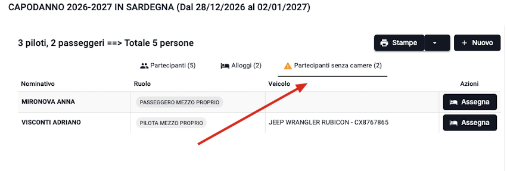
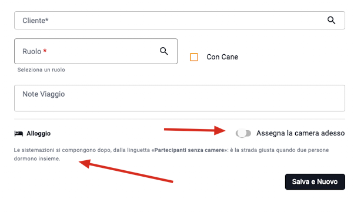
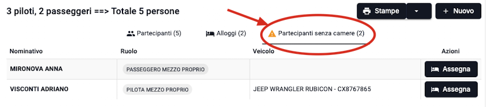
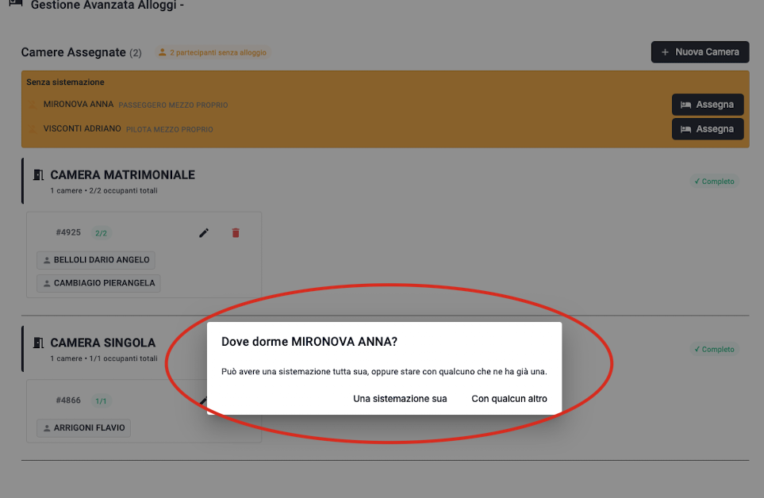
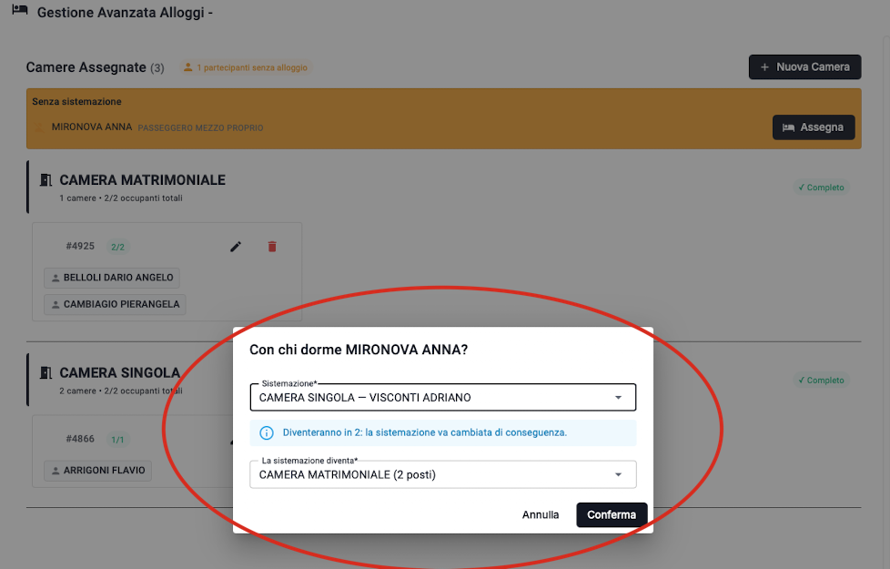
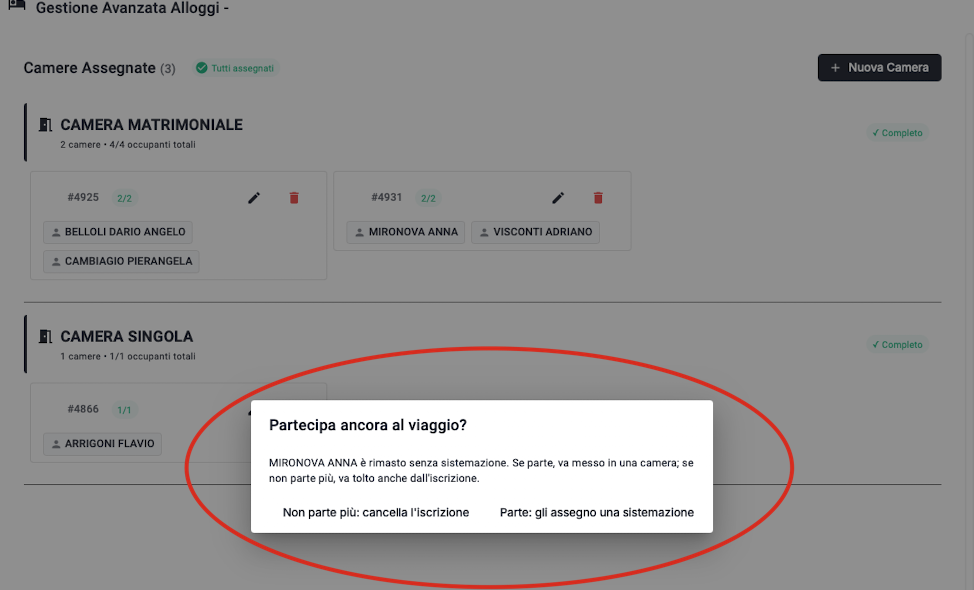
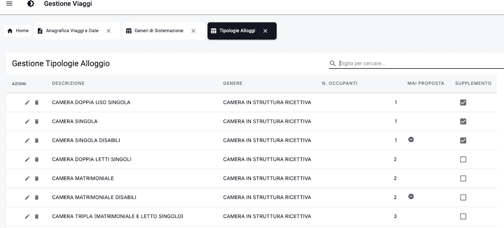

# Manuale — Iscrizioni e sistemazioni: cosa è cambiato

**Versione del programma**: 2.0.1
**A chi è rivolto**: chi iscrive i clienti ai viaggi e assegna le camere. Nessuna conoscenza tecnica richiesta.

---

## Perché questo manuale

Nella versione 2.0 la gestione delle camere è cambiata da cima a fondo. Non sono ritocchi:
sono cambiati i comandi, il momento in cui si assegna una camera, e le domande che il
programma fa quando qualcuno si sposta o rinuncia.

⚠️ **La strada sbagliata non dà errori.** È il motivo per cui questo manuale esiste. Se si
lavora come nella versione precedente il programma non protesta, ma per qualche minuto il
database dice una cosa falsa — e se in quel momento qualcuno stampa la rooming list per
l'albergo, quella cosa falsa parte via email.

Leggi almeno i capitoli 1 e 2: sono il 90% del lavoro quotidiano.

---

## Indice

- [Manuale — Iscrizioni e sistemazioni: cosa è cambiato](#manuale--iscrizioni-e-sistemazioni-cosa-è-cambiato)
  - [Perché questo manuale](#perché-questo-manuale)
  - [Indice](#indice)
  - [1. La regola che conta: la coppia](#1-la-regola-che-conta-la-coppia)
    - [La strada giusta](#la-strada-giusta)
    - [La strada sbagliata — e perché è sbagliata](#la-strada-sbagliata--e-perché-è-sbagliata)
  - [2. L'interruttore «Assegna la camera adesso» nasce spento](#2-linterruttore-assegna-la-camera-adesso-nasce-spento)
  - [3. La linguetta «Partecipanti senza camere»](#3-la-linguetta-partecipanti-senza-camere)
  - [4. Le due porte per comporre le camere](#4-le-due-porte-per-comporre-le-camere)
    - [La domanda «Dove dorme…?» e le sue due strade](#la-domanda-dove-dorme-e-le-sue-due-strade)
  - [5. La capienza deve corrispondere: non esistono camere a metà](#5-la-capienza-deve-corrispondere-non-esistono-camere-a-metà)
  - [6. Togliere qualcuno da una camera](#6-togliere-qualcuno-da-una-camera)
    - [Domanda 1 — «La sistemazione di chi resta»](#domanda-1--la-sistemazione-di-chi-resta)
    - [Domanda 2 — «Partecipa ancora al viaggio?»](#domanda-2--partecipa-ancora-al-viaggio)
  - [7. Il genere della sistemazione: perché in tenda non vedi le camere d'albergo](#7-il-genere-della-sistemazione-perché-in-tenda-non-vedi-le-camere-dalbergo)
  - [8. Le sistemazioni che il programma non propone mai da solo](#8-le-sistemazioni-che-il-programma-non-propone-mai-da-solo)
  - [9. «Iscrizione Veloce — solo pilota»: cosa fa e cosa non fa](#9-iscrizione-veloce--solo-pilota-cosa-fa-e-cosa-non-fa)
  - [10. Riepilogo in una pagina](#10-riepilogo-in-una-pagina)
    - [Le tre cose da non fare](#le-tre-cose-da-non-fare)

---

## 1. La regola che conta: la coppia

> ### **Quando sai già che dormiranno insieme, NON assegnare la camera al momento dell'iscrizione.**

È la regola pratica da cui dipende tutto il resto. Vale per una coppia, per due amici che
condividono, per una famiglia.

### La strada giusta

1. Apri **Gestisci Partecipanti** sulla partenza.
2. Iscrivi la **prima** persona lasciando l'interruttore **«Assegna la camera adesso» spento**
   (lo trovi già spento: vedi il capitolo 2).
3. Iscrivi la **seconda** allo stesso modo, sempre con l'interruttore spento.
4. Compare la linguetta **«Partecipanti senza camere (2)»**. Aprila.
5. Premi **Assegna** sul primo dei due nomi.
6. Il programma chiede **«Dove dorme…?»** e offre due strade:
   - **«In una camera che c'è già»** — solo se l'altra persona una camera ce l'ha **già**
   - ⭐️ **«In una camera nuova»** — ⚠️ **è questa quando siete partiti da zero tutti e due**
7. Scegliendo **«In una camera nuova»** si apre la scheda della camera: indica il tipo
   (per esempio CAMERA MATRIMONIALE) e poi, dal campo **«Aggiungi Occupante»**, aggiungi
   la seconda persona. Salva.

> ⚠️ **Il punto su cui ci si blocca, ed è il caso più comune.** Se iscrivi una coppia e
> nessuno dei due ha ancora una camera, **«In una camera che c'è già» non ti mostrerà
> l'altra persona** — e non è un difetto: lì dentro ci sono le *camere*, non le persone, e
> l'altra persona una camera non ce l'ha ancora.
> **La strada è sempre «In una camera nuova»**, dove li metti tutti e due insieme.

### La strada sbagliata — e perché è sbagliata

Viene naturale fare così: iscrivo lui, gli do una **camera singola**, poi iscrivo lei e
correggo mettendoli in matrimoniale. **Alla fine il risultato è giusto.**

⛔️ Ma fra il primo passo e la correzione — che possono essere cinque minuti come due giorni —
nel programma risulta che **lui dorme in una singola**. Quella singola:

- compare nella rooming list se qualcuno la stampa in quel momento;
- compare nei conteggi delle camere richieste all'albergo;
- **non è segnalata in nessun modo**, perché per il programma è un dato regolare.

Un dato sbagliato che sembra giusto è peggio di un dato mancante: quello mancante lo vedi,
è evidenziato in giallo, e qualcuno lo sistema.

> **In una riga:** iscrivere e sistemare sono **due lavori distinti**. Prima si iscrive tutti,
> poi si compongono le camere.

---

## 2. L'interruttore «Assegna la camera adesso» nasce spento

Nella scheda di iscrizione, nel riquadro **Alloggio**, c'è un interruttore:

> **Assegna la camera adesso**

⚠️ **Da questa versione nasce SPENTO.** Se arrivi dalla versione precedente ti aspetti di
trovarlo acceso: **non è una dimenticanza, è una scelta.** È il modo in cui si lavorava su
Oracle, ed è il modo che evita il problema del capitolo 1.

Sotto l'interruttore spento compare una riga che ti dice dove finire il lavoro:

> *Le sistemazioni si compongono dopo, dalla linguetta «Partecipanti senza camere»: è la strada
> giusta quando due persone dormono insieme.*

**Quando ha senso accenderlo:** solo se quella persona viaggia da sola e sai già che camera
avrà. In tutti gli altri casi lascialo spento.

---

## 3. La linguetta «Partecipanti senza camere»

È la linguetta nuova. Sta accanto alle altre, in alto, dentro **Gestisci Partecipanti**.

**Tre cose da sapere:**

1. **Compare solo se c'è qualcuno da sistemare**, e porta il conto fra parentesi:
   «Partecipanti senza camere (3)». Se non compare, non c'è niente in sospeso.
2. **Elenca nome, ruolo e veicolo** di chi è iscritto ma non ha ancora un letto, con un
   pulsante **Assegna** su ogni riga.
3. ⚠️ **Quando sparisce, il lavoro è finito.** È il segnale, e vale più di qualsiasi controllo:
   finché quella linguetta è lì, qualcuno partirà senza sapere dove dorme.

La stessa informazione la ritrovi anche dentro **Gestione Avanzata Alloggi**, nel riquadro
giallo **«Senza sistemazione»**. Sono due porte sulla stessa cosa: la linguetta serve a
vederlo **entrando**, senza dover aprire la scheda giusta.

---

## 4. Le due porte per comporre le camere

Le vie per comporre una sistemazione sono **due**. Non ce ne sono altre, e non servono.

| Situazione | Dove si fa | Cosa si apre |
|---|---|---|
| La camera **esiste già** e vuoi cambiare chi ci dorme | La **matita** ✏️ sulla camera, in Gestione Avanzata Alloggi | *Modifica Camera* |
| Una persona **non ha ancora** una camera | Il pulsante **Assegna** (nella linguetta o nel riquadro giallo) | *Dove dorme…?* |

### La domanda «Dove dorme…?» e le sue due strade

Premendo **Assegna**, il programma chiede dove va sistemata quella persona, e offre due strade.
⚠️ **La differenza conta**, ed è la cosa su cui ci si blocca più spesso.

#### ⭐️ «In una camera nuova» — quando nessuno ha ancora una camera

Si apre la scheda di una camera vuota, con quella persona già dentro. Indichi il **tipo** e,
dal campo **«Aggiungi Occupante»**, puoi metterci **anche gli altri partecipanti**.

⚠️ **È la strada per una coppia o una famiglia che si iscrive**: se nessuno dei due ha ancora
una camera, è l'unica che funziona.

#### «In una camera che c'è già» — quando l'altro è già sistemato

Ti fa scegliere una delle camere già presenti sulla partenza, **anche quelle piene**.
Questo è voluto: la moglie che prima aveva detto di no e poi decide di venire deve poter
dormire con il marito, e la sua camera è "piena" per definizione.

⚠️ **Qui dentro ci sono le camere, non le persone.** Chi non ha ancora una camera non compare —
e per lui la strada è quella di sopra.

Quando scegli una camera occupata, il programma avvisa:

> *Diventeranno in 2: la sistemazione va cambiata di conseguenza.*

e ti fa indicare **cosa diventa** quella camera (da singola a matrimoniale, oppure a doppia
letti singoli). ⚠️ **Lo scegli tu, non il programma**: due persone possono volere un letto
matrimoniale o due letti separati, e dal programma non si può sapere quale.

---

## 5. La capienza deve corrispondere: non esistono camere a metà

⛔️ Una camera da 2 posti deve avere **esattamente 2 occupanti**. Non uno, non tre. Il programma
rifiuta il salvataggio e dice perché.

**Non è una rigidità gratuita:** una camera doppia con un occupante solo, nel programma, non
si distingue da un errore di battitura. E in albergo diventa una discussione.

**Le eccezioni commerciali si gestiscono con il tipo di camera, non aggirando la regola:**

- una doppia pagata a uso singola → esiste il tipo **CAMERA DOPPIA USO SINGOLA** (1 posto);
- chi dorme nel proprio mezzo → esiste **NESSUNA CAMERA** (0 posti), ed è l'unico caso in cui
  la capienza non viene controllata.

⚠️ Gli accordi particolari con l'albergo — «tanto poi ce la danno matrimoniale» — restano
**fuori dal programma**: qui si registra cosa è stato prenotato, non cosa succederà alla
reception.

---

## 6. Togliere qualcuno da una camera

Quando sposti o togli una persona da una camera condivisa, il programma fa **due domande**. Non
si possono rimandare, ed è voluto.

### Domanda 1 — «La sistemazione di chi resta»

Se in una camera restano meno persone di prima, la camera **deve cambiare tipo**: una tripla
con due persone dentro non è più una tripla.

> *Spostando MARIO ROSSI, in CAMERA TRIPLA restano ANNA e LUCA — 2 persone. Con quale
> sistemazione va sostituita?*

L'elenco propone **solo** le sistemazioni della capienza giusta. ⚠️ Nelle versioni precedenti
il programma sceglieva da solo e in silenzio: poteva mettere in matrimoniale due amici che
volevano letti separati, su una camera che non stavi nemmeno guardando.

### Domanda 2 — «Partecipa ancora al viaggio?»

Chi resta senza camera è un iscritto senza letto: un buco che si scopre in albergo. Quindi il
programma chiede subito:

> **Partecipa ancora al viaggio?**
> *MARIO ROSSI è rimasto senza sistemazione. Se parte, va messo in una camera; se non parte
> più, va tolto anche dall'iscrizione.*
>
> - **Parte: gli assegno una sistemazione** → si apre la finestra per dargli una camera
> - **Non parte più: cancella l'iscrizione** → viene tolto dal viaggio

⚠️ **Se cancelli un pilota se ne vanno anche i suoi passeggeri.** Il programma te li **elenca
prima** di procedere: leggi quell'elenco, perché stai togliendo più persone di quelle che
credi.

---

## 7. Il genere della sistemazione: perché in tenda non vedi le camere d'albergo

Ogni tipo di sistemazione appartiene a un **genere**:

| Genere | Esempi |
|---|---|
| CAMERA IN STRUTTURA RICETTIVA | matrimoniale, singola, doppia letti singoli, tripla, quadrupla |
| TENDA IN CAMPO TENDATO | tenda 1/2/4 posti, noleggiata o di proprietà |
| NESSUNA SISTEMAZIONE | «NESSUNA CAMERA», per chi dorme nel proprio mezzo |

Ogni **tipologia di pernottamento** del viaggio dichiara quali generi ammette. Da lì il
programma sa che su un viaggio in campo tendato le camere d'albergo non vanno nemmeno
mostrate.

⚠️ **Se in un elenco manca la sistemazione che ti aspetti, il motivo è quasi sempre questo.**

**Dove si configura:** menu **Tabelle → Tipologie di Pernottamento**, colonna **«Sistemazioni
previste»**. I generi stessi si gestiscono in **Tabelle → Generi di Sistemazione** e si possono
aggiungere (per esempio CASA MOBILE o BUNGALOW).

⚠️ Fra le tipologie di pernottamento, la riga **«NESSUNO» non si può rinominare né cancellare**,
e non ammette sistemazioni: significa «non si dorme da nessuna parte», ed è quella su cui si
appoggia chi dorme nel proprio mezzo o a casa sua o a casa di qualcun altro. Se provi a modificarla il programma rifiuta — non è un
guasto.

---

## 8. Le sistemazioni che il programma non propone mai da solo

Le camere attrezzate per esigenze particolari — **CAMERA MATRIMONIALE DISABILI**, **CAMERA
SINGOLA DISABILI** — hanno una spunta:

> **Non proporre mai d'ufficio**
> *Resta scegliibile in elenco, ma il programma non la assegna da solo.*

Significa che:

- ✅ **ci sono**, le trovi in elenco e puoi sceglierle quando qualcuno le chiede;
- ⛔️ il programma **non le assegna mai automaticamente** a chi capita.

Sono camere che si danno a chi ne ha bisogno, non a chi arriva per primo. Prima non venivano
proposte solo perché erano state create dopo le altre.

**Dove si imposta:** menu **Tabelle → Tipologie Alloggi**, colonna **«Mai proposta»**.

---

## 9. «Iscrizione Veloce — solo pilota»: cosa fa e cosa non fa

Il pulsante **⚡️ Iscrizione Veloce — solo pilota** in Dashboard serve a **un caso solo**:

✅ **Una persona che viaggia da sola**, che iscrivi e sistemi in un colpo.

⛔️ **Non serve** per una coppia, una famiglia o un gruppo: lì si passa da **Gestisci
Partecipanti**, seguendo il capitolo 1.

⚠️ **In questa scheda l'interruttore «Assegna la camera adesso» è ACCESO**, al contrario di
Gestisci Partecipanti. Non è un'incoerenza: è l'unica scheda in cui la sistemazione si conosce
già, perché la persona è una e dorme da sola.

Il nome del pulsante lo dice: **solo pilota**. Se stai iscrivendo qualcuno che porterà dei
passeggeri, sei nel posto sbagliato.

---

## 10. Riepilogo in una pagina

| Se devi… | Fai così |
|---|---|
| Iscrivere **una coppia** o **un gruppo** | Gestisci Partecipanti → iscrivi tutti con l'interruttore **spento** → linguetta «Partecipanti senza camere» → **Assegna** |
| Iscrivere **una persona sola** | Iscrizione Veloce — solo pilota (l'interruttore lì è acceso, va bene) |
| Cambiare **chi dorme** in una camera esistente | La **matita** ✏️ sulla camera |
| Dare una camera a chi **non ce l'ha** | Il pulsante **Assegna** → **«In una camera nuova»** se nessuno ne ha ancora una |
| Sapere se **è rimasto qualcosa in sospeso** | Guarda se c'è la linguetta «Partecipanti senza camere»: se non c'è, hai finito |
| Capire perché **manca una sistemazione** in elenco | Tabelle → Tipologie di Pernottamento → «Sistemazioni previste» (capitolo 7) |

### Le tre cose da non fare

1. ⛔️ **Non** dare una singola al primo di una coppia contando di correggere dopo.
2. ⛔️ **Non** riaccendere l'interruttore «per comodità» quando iscrivi più persone insieme.
3. ⛔️ **Non** chiudere la scheda lasciando aperta la linguetta «Partecipanti senza camere». 
IN OGNI CASO QUANDO LANCERAI LA STAMPA DELLA ROOMING LIST, SE CI SARANNO PERSONE SENZA CAMERE TI VERRA' SEGNALATO, SIA A VIDEO CHE SULLA STAMPA
